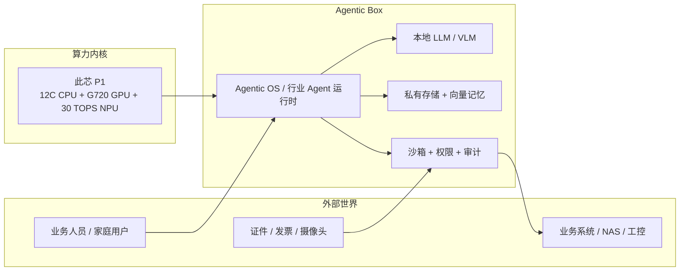
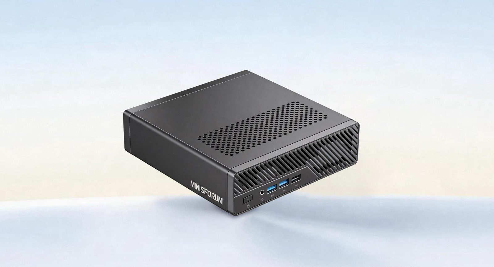
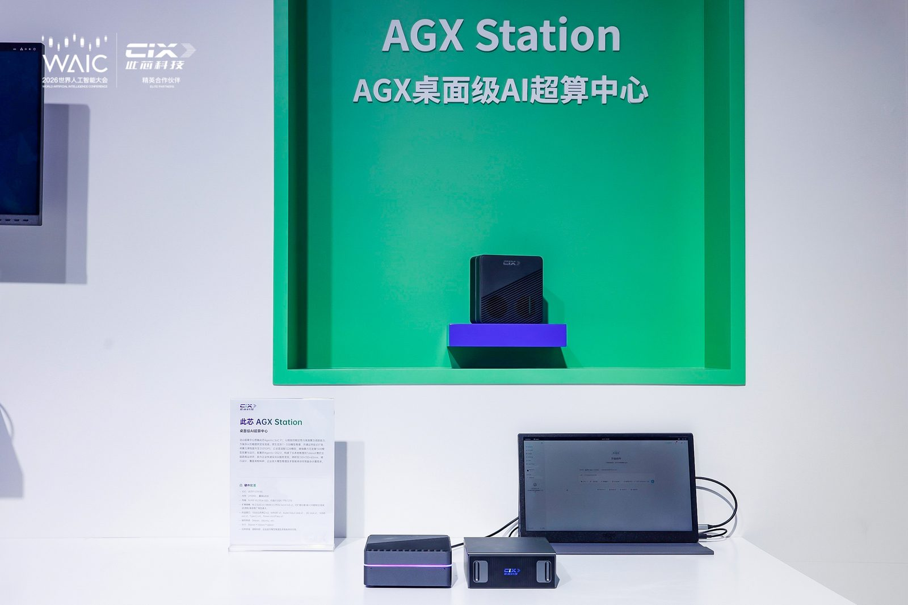
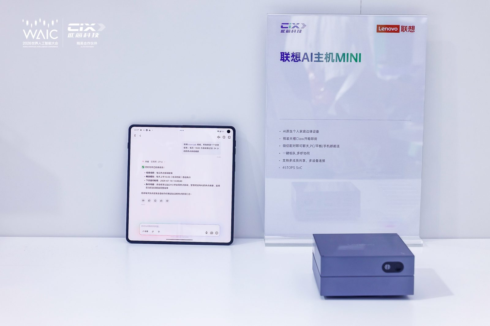
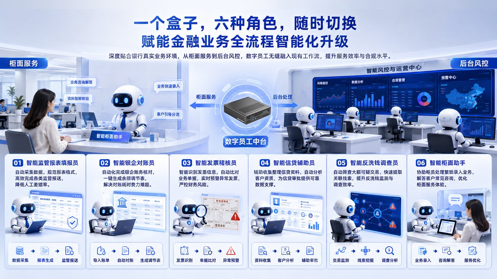
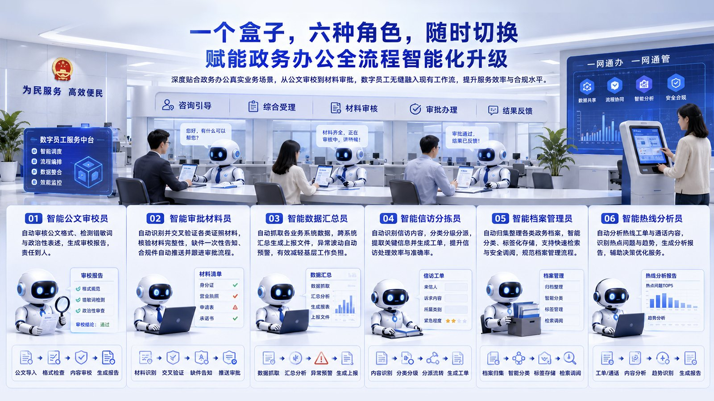
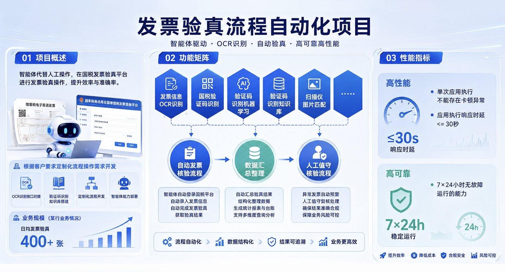

# Agentic Box 介绍：开箱即用的边缘智能体网关

> **定位**：Agentic Box 不是又一块加速卡，也不是云端 Agent Sandbox 的另一种叫法。它是此芯科技（CIX）在 **AGX Agentic Compute** 产品矩阵里给出的边端形态——一台预装芯片、模型和智能体运行时的「单盒式」网关，目标是让 Agent 在本地把任务跑完，而不是把数据和 Token 全部送上云。
>
> **下载**：[配套 PPT](./agentic-box-intro.pptx) · [资料下载清单](./downloads.md)（官方 SDK / BSP / TRM 入口；芯片手册需注册，不进仓库）

本文把 Agentic Box 放到本仓库的硬件与智能体基础设施两条线上来看：它解决的是「Agent 跑在哪、数据出不出域、能否 7×24 小时持续执行」的部署问题，而不是「Agent 怎么思考」的算法问题。阅读时可以对照 [GPGPU vs NPU](../nvidia/GPGPU_vs_NPU_大模型推理训练对比.md) 理解边端异构算力，对照 [Agent Sandbox 设计范式](../../08_agentic_system/agent_infra/docs/agent-sandbox-design.md) 理解软件隔离与硬件盒子的分工。

---

## 1. 一句话定义

**Agentic Box = 面向边缘场景的开箱即用智能体网关。**

公开资料对它的描述高度一致 [1,2]：

- **形态**：小型机箱 / 算力盒，可放在办公桌下、机柜或家庭侧，即插即用。
- **算力**：内置此芯自研 **Agentic SoC P1**，CPU + GPU + NPU 异构，综合 AI 算力约 **45 TOPS**。
- **能力**：支持大模型本地部署、私有存储、离线推理，以及多智能体调度。
- **边界**：数据默认不出域；智能体执行被沙箱、权限和审计约束。

它对应的不是「训练集群」，而是 Agent 的**本地手脚**：感知（多模态输入）、认知（本地 LLM / RAG）、执行（工具调用与系统操作）、记忆（本地向量库与日志）。

```text
云端 GPU 集群                桌面 AGX Station              边缘 Agentic Box
──────────────               ────────────────              ────────────────
70B–150B 训练/推理           可扩展加速卡 + RDMA            单盒、低功耗、开箱即用
Token 工厂、高并发            科研 / 企业本地超算            家庭 / 中小企业 / 柜面网关
数据上云或专有云              机房或工位级私有部署            办公桌下 / 弱网 / 可断网
```

---

## 2. 为什么会出现 Agentic Box

过去几年 AI 算力的主叙事是「把模型训得更大」。Agent 真正进入业务后，瓶颈换了位置 [3]：

1. **负载从训练变成持续推理与执行。** Agent 要拆解目标、调工具、写文件、填表单，会话很长，7×24 小时在线。峰值 FLOPS 不如「任务能否稳定做完」重要。
2. **数据不愿意上云。** 金融、政务、家庭影像、企业知识库对「不出域」是硬约束，而不是可选项。
3. **云 Token 成本与延迟不适合边端闭环。** 柜面稽核、热线分拣、家庭 NAS 问答需要毫秒到亚秒级响应，且不能按 Token 无限计费。
4. **部署门槛必须降到「通电即用」。** 命令行拉模型、配 CUDA、写 Docker Compose，挡掉了真正要落地的业务人员。

此芯把这组约束概括成三件事：**跑得稳、用得起、可持续** [3]。Agentic Box 就是这三件事在边缘侧的硬件答案：用一颗高能效 SoC 把模型、存储、沙箱和网关打成一个盒子。

---

## 3. 它在 AGX 矩阵里站哪一层

2026 年 WAIC 上，此芯发布了覆盖端、边、云、机器人的五条产品线 [1,2]。Agentic Box 是其中明确面向**边缘网关**的那一条：

| 产品线 | 形态 | 典型负载 | 和 Agentic Box 的关系 |
| --- | --- | --- | --- |
| **AGX Station** | 150×150×60 mm 桌面超算，M.2 / MXM / PCIe 可扩展，2×10G RDMA | 70B–150B 本地推理、多智能体并行 | 同一战略下的「工位级超算」，算力上限更高 |
| **Agentic Computer** | AI PC / 迷你主机（如联想 AI 主机 mini、P7） | 个人创作、多终端协同、本地 Token 工厂 | 个人侧形态；芯片同源，交互偏桌面 |
| **Agentic Box** | 开箱即用边缘智能体网关 | 本地知识库、离线推理、行业数字员工 | **本文主体**：弱运维、可断网、可放机柜 |
| **Agentic Infra** | 2U/3U Arm 阵列服务器（数十颗 P1） | 云手机、云渲染、高并发实例 | 云端横向扩展，不是单盒网关 |
| **Agentic Robot** | 135×86×40 mm 级小型主机，GMSL / CAN-FD / 5G | 机械臂、机器狗、ROS 2 协同 | 具身智能侧的「端侧大脑」 |

理解这个矩阵的关键是：**同一颗 P1，按 I/O、功耗、存储和加速卡扩展切成不同形态。** Agentic Box 牺牲的是峰值算力与可扩展性，换来的是部署半径——没有专职运维的办公室、网点、家庭和产线边缘。



---

## 4. 硬件底座：此芯 P1 Agentic SoC

Agentic Box 能「单盒跑 Agent」，前提是 SoC 同时具备通用调度、多媒体感知和本地推理，而不是只堆 NPU TOPS。公开规格如下 [4,5,6]：

| 项目 | 此芯 P1（CP8180）公开规格 |
| --- | --- |
| 制程 | 6 nm |
| CPU | Armv9.2，12 核（8 性能核 + 4 能效核），最高约 3.2 GHz；含 SVE2 向量扩展 |
| GPU | 10 核 Arm Immortalis-G720（Mali Avalon），支持 OpenGL / Vulkan / OpenCL，开源 Panthor / Panfrost |
| NPU | 约 30 TOPS；CPU+GPU+NPU 综合约 **45 TOPS** |
| 内存 | 最高 64 GB LPDDR5（约 6400 Mbps），共享内存带宽约 100 GB/s |
| I/O | PCIe 4.0、多路 USB-C、双 GMAC 等；可外挂 AI 加速卡 |
| 多媒体 | 8K@60 fps 解码、8K@30 fps 编码、多屏异显 |
| 安全 | Armv9 安全扩展、安全启动、TEE（OP-TEE）、硬件信任根 |
| 软件 | Linux Kernel 6.1/6.6（BSP 已到 6.6.89）、UEFI EDK2、Windows / 统信 / 麒麟、NeuralONE AI SDK |

对 Agent 负载，这组规格里真正关键的不是「45 TOPS」这个营销数字，而是三件事：

1. **CPU 必须够强。** Agent 的规划、工具编排、JSON schema、沙箱代理都是控制流密集任务，NPU 吃不下。后摩等合作方也强调：思考加执行必须 CPU 与 NPU 密切协同 [3]。
2. **内存容量决定上下文和本地模型上限。** 64 GB 共享内存让量化后的十亿到百亿参数模型、向量库和 KV 可以常驻端侧；这和「只有 8–16 GB 的消费级 NPU 盒子」不在一个档位。
3. **PCIe 4.0 是逃生门。** 单盒 45 TOPS 跑 7B–35B 够用；要上 70B+ 或更高吞吐，就外挂加速卡，或把任务上送到 AGX Station / 云侧。联想侧公开口径是：P1 本机可承载约 13B–35B 生产级 Agent，外加扩展卡可到约 7B–122B [7]。

边端 TOPS 与云端 GPU 的对比，见 [GPGPU vs NPU](../nvidia/GPGPU_vs_NPU_大模型推理训练对比.md)。这里只需记住：Agentic Box 优化的是**每瓦 Token 和数据主权**，不是训练吞吐。

---

## 5. 软件栈：盒子里到底跑什么

硬件只提供「能跑」；Agentic Box 的产品化来自软件把模型、工具和安全焊死在出厂镜像里。公开描述的软件层可以压成四段 [3,5]：

### 5.1 Agentic OS / AGX OS

面向智能体的操作系统，而不是再包一层 Linux 发行版皮肤。核心能力包括：

- **多智能体分布式调度**：把 CPU / NPU / 外挂加速器当成统一资源池。
- **MaaS 模型网关**：聚合 Qwen、Kimi、智谱、文心等，按需切换，避免单模型锁定。
- **标准化 API 与工具链**：让行业 Agent（数字员工、家庭助手）挂到同一套运行时上。

### 5.2 本地推理与记忆

- **NeuralONE**：异构 AI SDK，把视觉、语音、LLM 图下到 NPU / GPU。
- **本地 RAG**：私有向量库 + 外部知识库，记忆不出盒。
- **长上下文驻留**：模型权重、KV、会话状态尽量放在共享内存，减少反复加载。

现场演示过的模型量级包括 Qwen2.5-VL-7B、Qwen3、以及盒子形态上的 Qwen3.5-35B-A3B MoE [1]。MoE 稀疏激活特别适合 45 TOPS 级边端：激活专家少，内存却要装得下全部路由。

### 5.3 沙箱、权限与审计

AGX OS 把智能体落地的三个真实风险写进了产品定义 [3]：

| 风险 | 盒子里的对应机制 |
| --- | --- |
| 数据出域 | 本地推理与存储；可物理断网 |
| 模型碎片化 | 统一模型网关 |
| 自主执行失控 | 独立沙箱、四级权限、全链路审计：「计划可审、动作可批、过程可查、结果可回」 |

这和本仓库 [Agent Sandbox](../../08_agentic_system/agent_infra/docs/agent-sandbox-design.md) 讨论的是**同一类问题的不同层**：Sandbox 论文关心 syscall、Landlock、容器逃逸；Agentic Box 把沙箱做成整机出厂策略，并叠上芯片 TEE 与物理断网。盒子不能替代策略——凭证一旦进沙箱，Prompt 注入仍然能滥用它。正确拆分是：

```text
┌─────────────────────────────────────────────┐
│  Agentic Box（物理与电源边界、可断网）         │
│  ┌─────────────────────────────────────────┐ │
│  │  Agentic OS（模型网关、权限、审计）       │ │
│  │  ┌───────────────────────────────────┐  │ │
│  │  │  Agent Sandbox（进程/容器隔离）    │  │ │
│  │  │   工具代理持有密钥，Agent 看不到    │  │ │
│  │  └───────────────────────────────────┘  │ │
│  └─────────────────────────────────────────┘ │
└─────────────────────────────────────────────┘
```

更完整的「大脑 / 双手 / 会话」解耦，见 [扩展托管智能体](../../08_agentic_system/agent_infra/docs/scaling-managed-agents.md)。

### 5.4 行业 Agent 与生态框架

盒子上并不绑定单一 Agent 框架。公开落地包括：

- **OpenClaw / 天禧 Claw**：对话、组队、多终端互联 [1,7]。
- **ROS 2 + CIX Robotics SDK**：自然语言到机械臂 / 移动机器人 [1]。
- **数字员工运行时**：视觉抽取 → 规则推理 → 自动填报，日志本地留痕 [8]。

---

## 6. 已经能看到的盒子形态

「Agentic Box」在发布会上是产品线名称，落地时由生态伙伴做成具体 SKU [1,8]：

| 形态 | 代表 | 公开能力要点 |
| --- | --- | --- |
| 家庭 / 中小企业算力盒 | 贝启 KeyPi AIPC8180 | 私有存储 + 离线推理 + 4K 采编；可本地跑 Qwen3.5-35B-A3B |
| 边端推理终端 | 定昌 DC-ENP1 | 双模型并发，公开口径延迟低于 300 ms、画面响应高于 30 fps，CPU 占用约 40% |
| 数字员工单盒 | 电信联合方案 / 铭凡 MS-R1 等 P1 主机 | 发票、证件、表格识别；内网闭环；兼容 Windows / 统信 UOS |
| AI NAS | 来酷等 | 6 盘位、ZFS、ECC；影像 / 家居数据作为家庭级私有存算中心 |
| 开发板 / 准系统 | Radxa Orion O6、Orange Pi 6 Plus、P1 EVB | 用来自研盒子固件，而不是开箱即用网关 |

开发者软件入口在 [CIX Developer Center](https://developer.cixtech.com/)：BSP、NeuralONE、AI Model Hub、Ubuntu / Debian 镜像。完整下载清单见 [资料下载](./downloads.md)。

公开新闻里能直接看到三种常见盒子：







行业方案把同一只盒子切成「一盒六角色」。金融侧覆盖监管报表、银企对账、发票稽核、信贷辅助、反洗钱调查和柜面助手：



政务侧则是公文审校、审批材料、数据汇总、信访分拣、档案管理和热线分析：



发票验真是已经对外讲过的单点案例——OCR 对接国税验真平台，公开口径日均 400+ 张、响应不超过 30 秒、7×24 运行：



---

## 7. 典型工作流：盒子里的一次任务

以金融柜面「发票稽核」或家庭「问这批合同里的违约条款」为例，单盒路径大致是：

1. **感知**：摄像头 / 扫描仪 / 上传文件进入盒子；VPU/NPU 做 OCR 或多模态理解。
2. **检索**：本地向量库取出制度、历史单据、权限范围内的知识。
3. **规划**：Agent 把「验真 → 比对 → 预警 → 填报」拆成工具序列。
4. **执行**：沙箱内调用内网 API 或 RPA；密钥走 TEE / 代理，不进模型上下文。
5. **审计**：每一步写入不可抵赖日志；监管或家长可以事后调取。

整条链可以不出网线。需要更大模型时，网关把子任务打到 AGX Station 或云端，本地只留敏感字段的摘要——这就是 AGX 说的端边云协同，而不是「全部本地」或「全部上云」的二元选择。

---

## 8. 适用场景，以及它不该被用在哪

**适合：**

- 强合规、可断网：银行网点、政务大厅、医院科室。
- 弱运维边缘：门店、产线工位、家庭 NAS。
- 长驻守任务：盯盘、热线质检、档案整理、7×24 数字员工。
- 多模态边端：证件核验、4K 预览、本地文生图的轻量创意。

**不适合作为唯一算力：**

- 70B+ 稠密模型的高并发在线服务（那是 GPU 集群或 AGX Station + 加速卡的活）。
- 大规模预训练 / 全量 SFT（P1 不是训练芯片）。
- 需要把 Agent 弹性拉起成千上万个隔离微虚机的云原生平台（那是 [Kagent](../../08_agentic_system/agent_infra/docs/deep-dive-kagent-k8s-ops-agent.md) / Firecracker 类基础设施）。

选型时可以用三问快速过滤：数据能否出域？有没有人值守运维？峰值是「几个并发会话」还是「千级 QPS」？前两个答案偏向私有、无人值守，且并发不大，Agentic Box 才值得进短名单。

---

## 9. 和本仓库其它概念怎么对齐

| 本仓库条目 | 和 Agentic Box 的关系 |
| --- | --- |
| [GPGPU vs NPU](../nvidia/GPGPU_vs_NPU_大模型推理训练对比.md) | 解释为什么边端用 SoC+NPU 而不是搬一张 H100 |
| [TPU 101](../tpu/tpu%20101.md) | 对照：TPU 为数据中心矩阵流设计；P1 为端侧控制流 + 推理设计 |
| [Agent Sandbox](../../08_agentic_system/agent_infra/docs/agent-sandbox-design.md) | 盒子提供物理边界；Sandbox 提供进程级策略 |
| [OpenHarness](../../08_agentic_system/agent_infra/docs/openharness-deep-dive.md) | Harness 是「工具 + 记忆 + 运行边界」；Box 是把 Harness 焊在边缘硬件上 |
| [扩展托管智能体](../../08_agentic_system/agent_infra/docs/scaling-managed-agents.md) | 大脑与双手解耦后，Box 更像一双常驻现场的「手」 |
| [OpenClaw Operator](../../08_agentic_system/agent_infra/docs/openclaw-operator-deep-dive.md) | 云上用 K8s Operator 管 Agent；盒内用出厂镜像 + 本地编排 |

一句话：**Agentic Box 是 Agent Infra 的边缘硬件形态，不是 Agent 框架本身。**

---

## 10. 小结

Agentic Box 要记住的只有四条：

1. 它是 **边缘智能体网关**，开箱即用，强调数据不出域和持续执行。
2. 算力内核是 **此芯 P1**：Armv9.2 12 核 + G720 + 约 30 TOPS NPU，综合约 45 TOPS，最高 64 GB 共享内存。
3. 软件上把 **模型网关、沙箱、权限、审计** 做成整机能力，和云端 Agent Sandbox 互补而不是互相替代。
4. 它在 AGX 矩阵里站在 Station（可扩展超算）和 Infra（阵列服务器）之间，专门覆盖家庭、中小企业与行业网点。

对架构师而言，引入 Agentic Box 之前先把「哪些 Token 必须本地、哪些可以上云、密钥绝不能进模型上下文」画清楚。盒子解决的是部署与主权，解决不了提示注入和工具过权——那些仍然要靠沙箱策略和审计闭环。

---

## 11. 资料下载

- 本仓库：[配套 PPT](./agentic-box-intro.pptx)、[下载清单](./downloads.md)
- 官方 SDK / BSP / NeuralONE：https://developer.cixtech.com/
- 芯片手册 TRM 需注册审核，合计约九千页，不进本仓库

---

## 参考文献

[1] 此芯科技, “此芯科技亮相 WAIC 2026，全场景 Agentic Compute 算力矩阵首秀上海,” 2026. [Online]. Available: https://www.cixtech.com/list_6/206.html

[2] 爱集微, “WAIC 探展此芯，AGX 五大产品线重构算力新范式,” 2026. [Online]. Available: http://laoyaoba.com/n/1065927

[3] 此芯科技, “此芯科技发布 AGX Agentic Compute 战略，全域算力底座开启智能体计算新纪元,” 2026. [Online]. Available: https://www.cixtech.com/list_6/205.html

[4] CIX Technology, “CIX Developer Center / CIX P1 Product Introduction.” [Online]. Available: https://developer.cixtech.com/

[5] 此芯科技, “异构算力赋能边端智能，此芯科技携手大联大诠鼎推动智能体终端落地.” [Online]. Available: https://www.cixtech.com/list_6/196.html

[6] IT之家, “国产 AI PC 处理器「此芯 P1」发布：6nm 制程 Arm CPU，45TOPS 算力.” [Online]. Available: https://www.ithome.com/0/785/202.htm

[7] 此芯科技, “搭载此芯 Agentic SoC P1，联想 AI 主机 mini 正式开启预约.” [Online]. Available: https://www.cixtech.com/list_6/199.html

[8] 此芯科技, “此芯科技推出数字员工智能体方案，以 Agentic SoC 加速行业智能化升级.” [Online]. Available: https://www.cixtech.com/list_6/201.html
