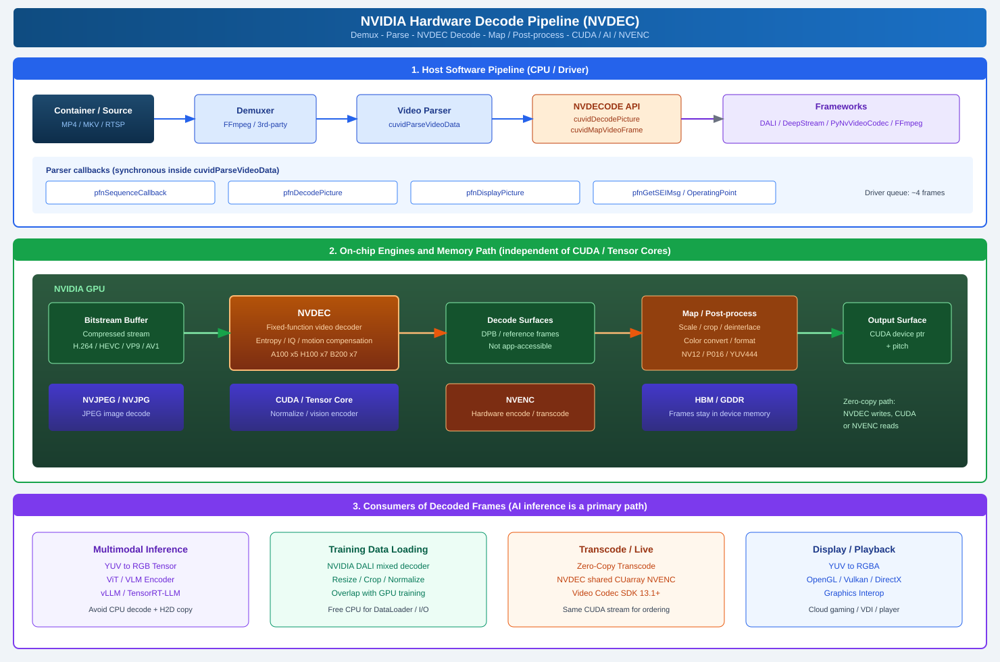
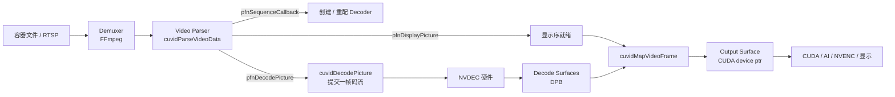

# NVIDIA 硬件解码流程：从 NVDEC 到 AI 推理输入

> 官方文档参考：
>
> - [NVDEC Video Decoder API Programming Guide (SDK 13.1)](https://docs.nvidia.com/video-technologies/video-codec-sdk/13.1/nvdec-video-decoder-api-prog-guide/)
> - [NVDEC Application Note](https://docs.nvidia.com/video-technologies/video-codec-sdk/13.1/nvdec-application-note/index.html)
> - [NVIDIA Video Codec SDK](https://developer.nvidia.com/video-codec-sdk)

NVIDIA GPU 上的“解码”有三条容易被混在一起的路径：

| 路径 | 发生在哪里 | 本文是否覆盖 |
| :--- | :--- | :--- |
| **视频 / 图像硬件解码** | NVDEC、NVJPEG 固定功能引擎 | 是，本文主题 |
| **大模型 Prefill / Decode** | Tensor Core + KV Cache，逐 token 生成 | 否，见 [推理系统](../../../09_inference_system/README.md) |
| **SM 指令译码** | Warp Scheduler 把 SASS 发给执行单元 | 否，属于 CUDA 微架构 |

下面只讲第一条：压缩码流如何被 NVDEC 解成显存里的 YUV 帧，再交给 CUDA、推理引擎或 NVENC。



---

## 1. 为什么 AI 基础设施要关心解码

图像和视频进入模型之前，必须先变成 Tensor。传统路径是：

1. CPU 用 FFmpeg / OpenCV / Pillow 解码；
2. 在主机内存里做 resize、crop、normalize；
3. `cudaMemcpy` 把 RGB 拷进显存。

这条路径有三个结构性问题：

- **CPU 成为瓶颈**：1080p / 4K 视频、高分辨率 JPEG 会把 DataLoader 打满，GPU 只能空等。
- **PCIe 被浪费两次**：原始压缩数据进主机内存，解完的大图再走一遍 Host-to-Device。一帧 1080p NV12 约 3 MB，未压缩 RGB 更大；压缩码流通常只有它的几十分之一。
- **和训练 / 推理抢核**：解码线程、Python GIL、网络 I/O 挤在同一组 CPU 上。

NVDEC 把第 1 步搬到 GPU 上的专用引擎，解码输出直接落在显存。CUDA 再做第 2 步。CPU 只负责读码流、解封装和提交解码任务。这正是 NVIDIA DALI `device="mixed"`、DeepStream、FFmpeg `hwaccel=cuda` 的共同前提。

---

## 2. GPU 上的媒体引擎：NVDEC 不是 CUDA Core

从 Fermi 开始，NVIDIA GPU 内部除了 SM，还有一组固定功能媒体引擎。它们和图形管线、CUDA 计算是分开调度的：

| 引擎 | 职责 | 与 SM 的关系 |
| :--- | :--- | :--- |
| **NVDEC** | H.264 / HEVC / VP8 / VP9 / AV1 等视频硬件解码 | 完全独立，解码不占用 CUDA Core |
| **NVENC** | 视频硬件编码 | 完全独立，可与 NVDEC 组成转码流水 |
| **NVJPEG / NVJPG** | JPEG 图像硬件解码（及部分编码） | 独立 JPEG 引擎；旧平台上 JPEG 走 CUDA+CPU 混合路径 |
| **CUDA Core / Tensor Core** | 通用计算、缩放、色彩转换、模型推理 | 消费 NVDEC / NVJPEG 的输出 |

几个对容量规划很关键的事实：

- **单路会话吃不满整卡。** NVDEC 驱动内部有大约 4 帧的流水队列，但**单路解码的峰值不超过单颗 NVDEC 引擎**的吞吐。多引擎的收益来自**多路并发会话**。
- **驱动负责负载均衡。** 应用不需要指定“用第几颗 NVDEC”。只要开多个 decode session，驱动会把它们摊到多颗引擎上。
- **引擎数量随规格变化。** 消费级卡通常 1 颗；数据中心旗舰更多，例如 A100 约 5 颗 NVDEC + 5 颗 JPEG，H100 / B200 约 7 颗 NVDEC + 7 颗 JPEG。具体以 [Video Codec SDK Support Matrix](https://developer.nvidia.com/nvidia-video-codec-sdk) 为准。
- **Hopper / GA100 没有 AV1 硬件解码。** AV1 Main Profile 从 GA10x（Ampere 消费/专业线）和 Ada 开始；H100 沿用 Turing 代 NVDEC，不能硬件解 AV1。这是多模态集群选型时最容易踩的坑之一。

Blackwell 这一代对媒体引擎做了一次明显加码：H.264 单引擎吞吐大约翻倍，并补上 H.264 / HEVC 的 4:2:2 解码，面向广电和专业制作，同时也让高码率监控、医疗影像这类输入更容易直接进 GPU。

---

## 3. 软件栈：从应用到硅

应用几乎不会直接打 NVDEC 的 MMIO。中间隔着一层稳定的用户态 API，由显示驱动提供：

```text
应用
  ├── NVIDIA DALI          （训练 / 推理预处理）
  ├── DeepStream           （视频分析流水线）
  ├── FFmpeg (h264_cuvid / hevc_cuvid / av1_cuvid)
  ├── PyNvVideoCodec       （Python 绑定）
  └── 自研服务
        └── NVDECODE API   （cuviddec.h / nvcuvid.h）
              └── libnvcuvid.so  /  nvcuvid.dll   ← 打在 NVIDIA 驱动里
                    └── NVIDIA Kernel Driver
                          └── NVDEC 硬件
```

要点：

- Linux 上解码库是驱动的一部分（`libnvcuvid.so`），**不是** CUDA Toolkit 单独安装的。驱动版本必须满足对应 Video Codec SDK 的最低要求。
- NVDECODE API 暴露两个头文件：`cuviddec.h`（解码器）和 `nvcuvid.h`（解析器、源）。
- Parser 是**纯软件**组件，可以换成 FFmpeg 自己的解析器；Decoder 才真正走到 NVDEC。
- Demuxer（从 MP4 / MKV / MPEG-TS 里抽出视频 PES / NALU）官方不提供，通常用 FFmpeg。

---

## 4. 三阶段流水线：Demux → Parse → Decode

官方把解码流水线拆成三个互不绑定的组件。可以只用其中一段，也可以三段一起用。



### 4.1 Demuxer

职责是把容器解成**裸视频码流 + 时间戳 + 标志位**。NVDECODE API 不负责这一步。实践中几乎都用 FFmpeg：

- 文件：`av_read_frame()` 取出 `AVPacket`；
- 直播：RTSP / MPEG-TS 同样先 demux，再把 payload 交给 parser。

这一步仍在 CPU 上。好消息是压缩码流很小，CPU 和 PCIe 压力都远低于解完的帧。

### 4.2 Video Parser

Parser 吃的是 `CUVIDSOURCEDATAPACKET`：payload 指针、长度、PTS、以及一组 flags。调用 `cuvidParseVideoData()` 后，解析在**当前线程同步**完成，并通过回调把事件推回应用：

| 回调 | 何时触发 | 应用通常做什么 |
| :--- | :--- | :--- |
| `pfnSequenceCallback` | 首个 sequence header，或分辨率 / 编码参数变化 | 读取 `min_num_decode_surfaces`，创建或 `cuvidReconfigureDecoder()` |
| `pfnDecodePicture` | 一帧（或一场）码流拼齐 | 填 `CUVIDPICPARAMS`，调用 `cuvidDecodePicture()` |
| `pfnDisplayPicture` | 一帧按**显示序**就绪 | 把 `nPicIdx` 放进队列，让 mapping 线程去 Map |
| `pfnGetSEIMsg` | H.264 / HEVC / AV1 的未注册 SEI / OBU | 抽 HDR、时间码、用户数据 |
| `pfnGetOperatingPoint` | AV1 scalable stream | 选择 operating point |

几个容易写错的 packet flag：

- `CUVID_PKT_ENDOFSTREAM`：最后一个包必须带。Parser 会把显示队列里剩下的帧全部回调出来。
- `CUVID_PKT_DISCONTINUITY`：seek 或切流之后要带，否则参考帧状态是脏的。
- `CUVID_PKT_ENDOFPICTURE`：这个包恰好是完整一帧时带上，避免 NALU 边界检测造成的一帧延迟。
- `CUVID_PKT_TIMESTAMP`：只有带了这个 flag，packet 里的 PTS 才有效。

`ulMaxNumDecodeSurfaces` 在创建 parser 时往往还不知道。常规写法是先填 1，等第一次 `pfnSequenceCallback` 返回真正的 DPB 大小，再创建 decoder。Sequence callback 返回值 `> 1` 时，驱动会用这个值覆盖 parser 的 decode surface 数量。

### 4.3 Video Decoder（NVDEC）

Decoder 才是硬件入口。生命周期是：

1. 绑定一个有效的 CUDA context（后续所有 API 都在这个 context 里）。
2. `cuvidGetDecoderCaps()` 查询当前 GPU 是否支持该 codec / chroma / bit depth / 分辨率。
3. `cuvidCreateDecoder()` 按 `CUVIDDECODECREATEINFO` 建会话。
4. 循环 `cuvidDecodePicture()` 提交图片。
5. `cuvidMapVideoFrame()` 等到解码完成，拿到 CUDA 指针。
6. 处理完后 `cuvidUnmapVideoFrame()`。
7. 结束时 `cuvidDestroyDecoder()`，再销毁 CUDA context。

`cuvidDecodePicture()` **只是把任务踢给 NVDEC**，不等待完成。真正的完成点是对应的 `cuvidMapVideoFrame()` 返回。

---

## 5. 显存里有两层 surface，不要当成一块 buffer

这是理解 NVDEC 性能和内存占用的关键。

```text
                    cuvidDecodePicture()
  压缩码流  ----------------------------►  Decode Surfaces (DPB)
                                              │  驱动内部分配
                                              │  存参考帧，应用摸不到
                                              ▼
                                      cuvidMapVideoFrame()
                                              │  格式转换 / 缩放 / 裁剪 / 去隔行
                                              ▼
                                         Output Surfaces
                                              │  应用拿到 CUdeviceptr + pitch
                                              ▼
                                      cuvidUnmapVideoFrame()
```

- **Decode Surfaces（`ulNumDecodeSurfaces`）**  
  数量下限来自 parser 的 `min_num_decode_surfaces`（H.264/HEVC 的 DPB）。设太小会解码错误或卡住；设太大浪费显存。它们是硬件写参考帧的地方，**不能**直接拿去跑 CUDA Kernel。

- **Output Surfaces（`ulNumOutputSurfaces`）**  
  应用能同时 Map 住的最大帧数。Map 会把 decode surface 转成 `OutputFormat`（常见是 NV12、10bit 的 P016），并按创建 decoder 时指定的 target 尺寸做缩放和裁剪。只 Map 不 Unmap，下一次 Map 最终会失败。

驱动内部还维护大约 **4 帧的硬件流水队列**。这不引入额外的“必须等 4 帧才能出第一帧”的延迟：第一帧提交后就会开始解。但要吃满 NVDEC，官方建议**解码队列里始终至少保持 2 张图**，典型节奏是：

```text
cuvidDecodePicture(N)
cuvidMapVideoFrame(N-4)     // 解更早的帧，和当前提交重叠
CUDA 后处理
cuvidUnmapVideoFrame(N-4)
cuvidDecodePicture(N+1)
...
```

创建 decoder 时还可以把后处理直接烘焙进去，避免自己写 Kernel：

- `ulTargetWidth / ulTargetHeight`：缩放；
- `display_area`：裁剪；
- `target_rect`：显示比例变换；
- `DeinterlaceMode`：逐行内容用 Weave/Bob，隔行用 Adaptive（更吃显存）。

如果码流只有 I/IDR 帧（抽帧、某些监控 GOP），把 `ulIntraDecodeOnly = 1`，驱动可以少分配参考帧。

---

## 6. 推荐的线程模型：解码线程和 Mapping 线程拆开

`cuvidMapVideoFrame()` 是阻塞的：它要等 NVDEC 解完这一帧。如果和 `cuvidDecodePicture()` 放在同一条 CPU 线程上，Map 会把后续提交堵住，硬件队列填不满。

官方推荐的生产者-消费者模型：

```text
[Demux / Parse / Decode 线程]                  [Mapping / Compute 线程]
        |                                              |
  cuvidParseVideoData()                                |
        | pfnDecodePicture                             |
  cuvidDecodePicture(N)                                |
        | pfnDisplayPicture                            |
  把 nPicIdx 放入队列  ----------------------------►  取出 nPicIdx
        | 立即返回，继续解下一帧                        |
        |                                        cuvidMapVideoFrame()
        |                                        CUDA Kernel / 推理
        |                                        cuvidUnmapVideoFrame()
```

约束：Decode 线程在 mapping 线程释放对应 DPB 槽位之前，不能复用那个 `nPicIdx`。实践中用有界队列做反压，队列深度和 `ulNumDecodeSurfaces` 对齐。

Video Codec SDK 13.1 的样例把这条思路又推进一步：Decode、CUDA Compute、Encode、Output 四条线程，用显式队列和 token 传递 surface 所有权，用来做零拷贝转码。

---

## 7. API 调用骨架

下面这段伪代码按官方顺序把一次 HEVC 10-bit 会话串起来，便于对照头文件阅读。真正工程代码还要处理 sequence 变化、错误码和 EOS。

```c
// 1. CUDA context
cuInit(0);
CUdevice dev; cuDeviceGet(&dev, gpu_id);
CUcontext ctx; cuCtxCreate(&ctx, 0, dev);

// 2. 能力查询：当前卡能不能解这块内容
CUVIDDECODECAPS caps = {};
caps.eCodecType      = cudaVideoCodec_HEVC;
caps.eChromaFormat   = cudaVideoChromaFormat_420;
caps.nBitDepthMinus8 = 2;               // 10-bit
cuvidGetDecoderCaps(&caps);
if (!caps.bIsSupported) { /* 回退到 CPU 或换卡 */ }

// 3. Parser（surface 数先填占位）
CUVIDPARSERPARAMS pp = {};
pp.CodecType = cudaVideoCodec_HEVC;
pp.ulMaxNumDecodeSurfaces = 1;
pp.pfnSequenceCallback    = HandleSequence;   // 内部再 cuvidCreateDecoder
pp.pfnDecodePicture       = HandleDecode;
pp.pfnDisplayPicture      = HandleDisplay;
CUvideoparser parser;
cuvidCreateVideoParser(&parser, &pp);

// 4. 送包（payload 来自 FFmpeg demux）
CUVIDSOURCEDATAPACKET pkt = {};
pkt.payload      = nalu;
pkt.payload_size = nalu_size;
pkt.timestamp    = pts;
pkt.flags        = CUVID_PKT_TIMESTAMP;
cuvidParseVideoData(parser, &pkt);

// 5. HandleDecode 里：
cuvidDecodePicture(decoder, &pic_params);

// 6. Mapping 线程里：
CUVIDPROCPARAMS proc = {};
proc.progressive_frame = 1;
CUdeviceptr devptr; unsigned pitch;
cuvidMapVideoFrame(decoder, nPicIdx, &devptr, &pitch, &proc);
// devptr 指向 NV12/P016，可直接喂 CUDA Kernel
cuvidUnmapVideoFrame(decoder, devptr);

// 7. 收尾
cuvidDestroyVideoParser(parser);
cuvidDestroyDecoder(decoder);
cuCtxDestroy(ctx);
```

Sequence callback 里创建 decoder 的关键字段：

```c
CUVIDDECODECREATEINFO ci = {};
ci.CodecType           = cudaVideoCodec_HEVC;
ci.ChromaFormat        = cudaVideoChromaFormat_420;
ci.OutputFormat        = cudaVideoSurfaceFormat_P016;  // 10-bit
ci.ulWidth             = coded_width;
ci.ulHeight            = coded_height;
ci.ulTargetWidth       = coded_width;   // 不缩放就保持原分辨率
ci.ulTargetHeight      = coded_height;
ci.ulNumDecodeSurfaces = format->min_num_decode_surfaces;
ci.ulNumOutputSurfaces = 4;             // 同时 Map 住的上限
ci.bitDepthMinus8      = 2;
ci.DeinterlaceMode     = cudaVideoDeinterlaceMode_Weave;
cuvidCreateDecoder(&decoder, &ci);
```

输出格式必须落在 `caps.nOutputFormatMask` 里。8-bit 常见 `cudaVideoSurfaceFormat_NV12`，10/12-bit 常见 `P016`。需要 RGB 时，不要指望 NVDEC 直接出 RGB，而是 Map 出 YUV 后用 CUDA Kernel、NPP 或 CV-CUDA 做色彩转换。

分辨率变化不必销毁会话：创建时把 `ulMaxWidth / ulMaxHeight` 留出余量，运行中走 `cuvidReconfigureDecoder()`。

---

## 8. 图像解码：NVJPEG 和 Hybrid JPEG

视频走 NVDEC；静态图是另一条引擎。

| 路径 | 适用 | 说明 |
| :--- | :--- | :--- |
| **NVJPEG / NVJPG** | 现代 GPU 上的 JPEG | 专用 JPEG 引擎，DALI `decoders.Image(device="mixed")` 默认走这条 |
| **Hybrid JPEG（CUDA + CPU）** | NVDECODE API 列出的 JPEG codec | 不是纯 NVDEC；Jetson 上不支持这条 NVDECODE JPEG |
| **CPU 解码** | PNG / WebP / 不规则 JPEG | 仍需 H2D；能 CPU 解的格式再上传 |

A100 / H100 / B200 这类数据中心 GPU 带多颗 JPEG 引擎，和 NVDEC 一样靠多会话叠加吞吐。多模态服务里“大量 JPEG 小图”和“少量长视频”要分开规划：前者看 `NVJPG` 利用率，后者看 `NVDEC`。

---

## 9. 上层框架怎么接到这条流水线上

大多数业务不该从 `cuvidCreateDecoder` 写起，而是选对封装层。

### 9.1 NVIDIA DALI（训练和离线推理预处理）

DALI 的 `mixed` 解码器就是“CPU 读文件，GPU 解码”：

```python
from nvidia.dali import pipeline_def, fn, types

@pipeline_def(batch_size=16, num_threads=4, device_id=0)
def video_pipe(file_list):
    encoded, label = fn.readers.numpy(file_list=file_list)
    # 图像：JPEG → NVJPEG；视频另用 fn.readers.video / decoders.video
    images = fn.decoders.image(encoded, device="mixed", output_type=types.RGB)
    images = fn.resize(images, device="gpu", size=224)
    images = fn.crop_mirror_normalize(
        images, device="gpu",
        mean=[0.485 * 255, 0.456 * 255, 0.406 * 255],
        std=[0.229 * 255, 0.224 * 255, 0.225 * 255],
    )
    return images, label
```

和纯 OpenCV 相比，瓶颈从 CPU 像素遍历转到显存带宽，这通常正是我们想要的。

### 9.2 FFmpeg 硬件加速

FFmpeg 通过 `h264_cuvid` / `hevc_cuvid` / `av1_cuvid` 调用同一套 NVDEC：

```bash
# 解码到 GPU，再 lavfi scale_cuda，最后编码（转码）
ffmpeg -hwaccel cuda -hwaccel_output_format cuda \
  -c:v hevc_cuvid -i input.mp4 \
  -vf "scale_cuda=1280:720" \
  -c:v h264_nvenc -preset p5 output.mp4
```

`-hwaccel_output_format cuda` 让解码帧留在显存，后续 filter 和 NVENC 不再下到 CPU。漏掉这个 flag，FFmpeg 会把帧 download 回主机，硬件解码的优势基本被吃掉。

### 9.3 DeepStream / PyNvVideoCodec

- **DeepStream**：把 NVDEC、推理（TensorRT）、OSD、NVENC 串成 GStreamer pipeline，适合多路摄像头。
- **PyNvVideoCodec**：Video Codec SDK 的 Python 绑定，适合在 PyTorch 服务里直接拿 CUDA Tensor。

### 9.4 零拷贝转码（SDK 13.1）

传统转码是 `NVDEC → CUDA 转换 → 拷到 NVENC 输入`。13.1 允许用 `CUDA_ARRAY3D_VIDEO_ENCODE_DECODE` 分配 `CUarray`，同时注册给 decoder 的外部输出和 encoder 的输入。NVDEC 和 NVENC 按两边都能识别的格式读写同一块显存，用同一条 CUDA Stream 保序。对“解码只是为了再编码”的场景，这能去掉中间色彩转换和一次显存拷贝。

### 9.5 接到多模态推理

解码之后的典型张量路径：

```text
NVDEC Output (NV12, device)
    → CUDA CSC + Resize + Normalize     （CV-CUDA / NPP / 自写 Kernel）
    → Vision Encoder                    （ViT / SigLIP / CLIP，TensorRT 或 PyTorch）
    → 视觉 token 与文本 token 拼接
    → LLM Prefill / Decode              （vLLM / TensorRT-LLM）
```

这里 NVDEC 解决的是**输入侧**；LLM 的 Decode 阶段是**输出侧**。两者可以在同一张卡上并行：媒体引擎解下一帧，Tensor Core 在生成 token。监控时不要只用 `GPU-Util`，否则会出现“利用率很低但视频 pipeline 已经打满 NVDEC”的误判。更完整的多模态策略见 [多模态推理优化](../../../09_inference_system/reference_design/10-多模态推理优化.md)。

---

## 10. 能力矩阵与性能直觉

下表摘自 Video Codec SDK 13.1 Application Note，只保留对 AI / 数据中心最有用的几列。完整矩阵以官网为准。

| 能力 | Turing / GA100 / Hopper | GA10x / Ada | Blackwell |
| :--- | :---: | :---: | :---: |
| H.264 Baseline/Main/High | 是 | 是 | 是（最高 8K，Level 6.2） |
| H.264 High10 / High422 | 否 | 否 | 是 |
| HEVC Main / Main10，含 8K | 是 | 是 | 是 |
| HEVC 4:2:2 10/12 | 否 | 否 | 是 |
| HEVC 4:4:4 | 是（部分型号） | 是 | 是 |
| VP9 8/10/12-bit，含 8K | 是 | 是 | 是 |
| AV1 Main | **否** | 是 | 是 |
| 多颗 NVDEC | 部分型号 | 部分型号 | 部分型号 |

单引擎、1080p YUV 4:2:0、最高视频时钟下的指示性帧率（SDK 13.1）：

| 架构 | H.264 | HEVC | HEVC Main10 | VP9 | AV1 |
| :--- | ---: | ---: | ---: | ---: | ---: |
| Turing | 771 | 1316 | 1158 | 932 | — |
| Ampere | 748 | 1415 | 1299 | 1075 | 790 |
| Ada | 903 | 1641 | 1520 | 1290 | 1018 |
| Blackwell | **2172** | 1872 | 1818 | 1445 | 1119 |

怎么用这些数字：

- 表中是**单颗 NVDEC**。A100 有 5 颗时，多路并发的聚合吞吐大约 ×5，但一路 4K 视频不会因此快 5 倍。
- 帧率随 `nvidia-smi` 报出的 video clock 近似线性变化。数据中心卡在空闲时可能降频，压测前要确认时钟。
- Hopper 的 NVDEC 架构与 Turing 相同，性能按时钟缩放；**不要按 H100 的 Tensor Core 规格去外推解码能力**。

---

## 11. 可观测性：不要只看 GPU-Util

NVDEC 忙的时候，SM 完全可以是空的，`nvidia-smi` 的 `GPU-Util` 会骗人。应该单独看解码引擎：

```bash
# 解码引擎利用率（百分比）
dcgmi dmon -e 204   # DCGM_FI_DEV_DEC_UTIL

# 或用 nvidia-smi 的 dmon / 查询字段（字段名随驱动版本略有差异）
nvidia-smi dmon -s u
```

| 指标 | 含义 | 典型用途 |
| :--- | :--- | :--- |
| `DCGM_FI_DEV_DEC_UTIL` | NVDEC 利用率 | 视频 pipeline 是否打满解码器 |
| `DCGM_FI_DEV_ENC_UTIL` | NVENC 利用率 | 转码 / 推流 |
| `DCGM_FI_DEV_JPEG_UTIL`（若有） | JPEG 引擎 | 图片 DataLoader |
| SM / Tensor 利用率 | CUDA / 推理 | 和上面三条一起看，才能判断是解码慢还是模型慢 |
| 显存 | DPB + output surface + 模型 | `ulNumDecodeSurfaces` 过大时这里先爆 |

Nsight Systems 时间线上，NVDEC 活动不会显示成普通 CUDA Kernel。如果只抓 Kernel，会以为 GPU“什么都没干”。需要同时看 NVDEC/NVENC trace 和 CUDA memcpy。

---

## 12. 实践清单与常见坑

**设计阶段**

- 先用 `cuvidGetDecoderCaps()`（或 FFmpeg `hevc_cuvid` 探测）确认 codec、bit depth、chroma、分辨率。H100 解不了 AV1，这不是驱动没装好。
- 单路实时 1080p 几乎任何近代 NVDEC 都能轻松超过 realtime；真正要算的是**并发路数 × 分辨率 × 编码类型**是否超过 `引擎数 × 单引擎 fps`。
- 把 decode surface 数设成 parser 报告的最小值附近再加一点流水余量，不要按“越多越快”堆显存。

**实现阶段**

- CUDA context 必须在查询 caps、创建 decoder、Map 之前就绑定好，且不要跨线程乱切 context。
- Decode 和 Map 分线程；Map 之后尽快 Unmap。
- seek / 切流带 `CUVID_PKT_DISCONTINUITY`，EOS 带 `CUVID_PKT_ENDOFSTREAM`。
- 需要 RGB Tensor 时在 GPU 上做 CSC，不要 Map 完立刻 `cudaMemcpy` 回主机再转。
- FFmpeg 记得加 `-hwaccel_output_format cuda`。

**运行阶段**

- 监控 `DEC_UTIL` 和 SM 利用率：前者高、后者低 → 解码已饱和，该加卡或降分辨率；反过来则是模型侧瓶颈。
- 多租户时注意 NVDEC 是整卡共享的。MIG 对媒体引擎的切分能力弱于 CUDA，视频解码型负载往往不适合按 MIG instance 精细切片。
- 驱动版本和 Video Codec SDK / DALI / DeepStream 的对应表要锁死，容器镜像里只装 Toolkit、宿主机驱动过旧，是线上最常见的 “codec not supported”。

---

## 13. 和仓库里其它文档的关系

- 想看 GPU 内部 SM、显存层次： [深入理解 GPU 架构](../understand_gpu_architecture/README.md)
- 想看 PCIe / GPUDirect 如何让码流少走 CPU： [GPUDirect RDMA 与 Storage](../../gpudirect/01_gpudirect_technology.md)
- 想看解码之后的多模态服务怎么做： [多模态推理优化](../../../09_inference_system/reference_design/10-多模态推理优化.md)
- 想看另一条完全不同的 “Decode”（LLM 逐 token）： [vLLM](../../../09_inference_system/vllm/README.md)

---

## 14. 参考资料

离线包（含本文 HTML 与官方 SDK 13.1 文档副本）：[nvidia_nvdec_decode_docs.zip](references/nvidia_nvdec_decode_docs.zip)。目录说明见 [references/README.md](references/README.md)。

- [NVDEC Video Decoder API Programming Guide](https://docs.nvidia.com/video-technologies/video-codec-sdk/13.1/nvdec-video-decoder-api-prog-guide/)（[本地 Markdown](references/official/NVDEC_Video_Decoder_API_Programming_Guide.md)）
- [NVDEC Application Note](https://docs.nvidia.com/video-technologies/video-codec-sdk/13.1/nvdec-application-note/)（[本地 Markdown](references/official/NVDEC_Application_Note.md)）
- [NVIDIA Video Codec SDK 13.1：Zero-Copy Transcode](https://developer.nvidia.com/blog/nvidia-video-codec-sdk-13-1-zero-copy-transcode-av1-b-frames-and-frame-accurate-seek/)
- [Video Codec SDK 下载与 GPU 支持矩阵](https://developer.nvidia.com/video-codec-sdk)
- [Using FFmpeg with NVIDIA GPU Hardware Acceleration](https://docs.nvidia.com/video-technologies/video-codec-sdk/13.1/ffmpeg-with-nvidia-gpu/)（[本地 Markdown](references/official/Using_FFmpeg_with_NVIDIA_GPU_Hardware_Acceleration.md)）
- [NVIDIA DALI 文档](https://docs.nvidia.com/deeplearning/dali/user-guide/docs/)
