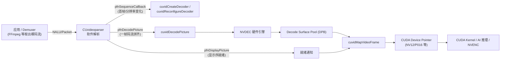
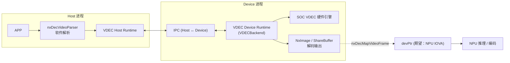
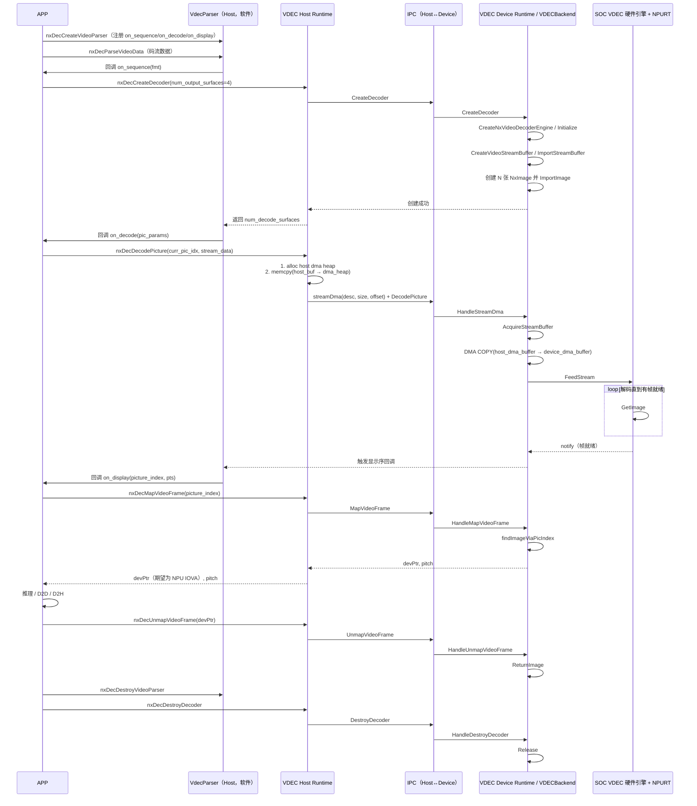
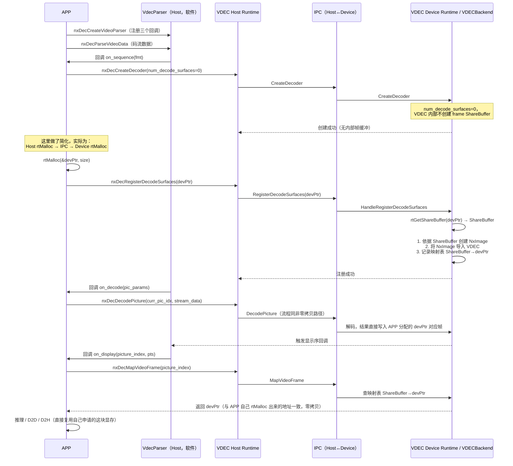
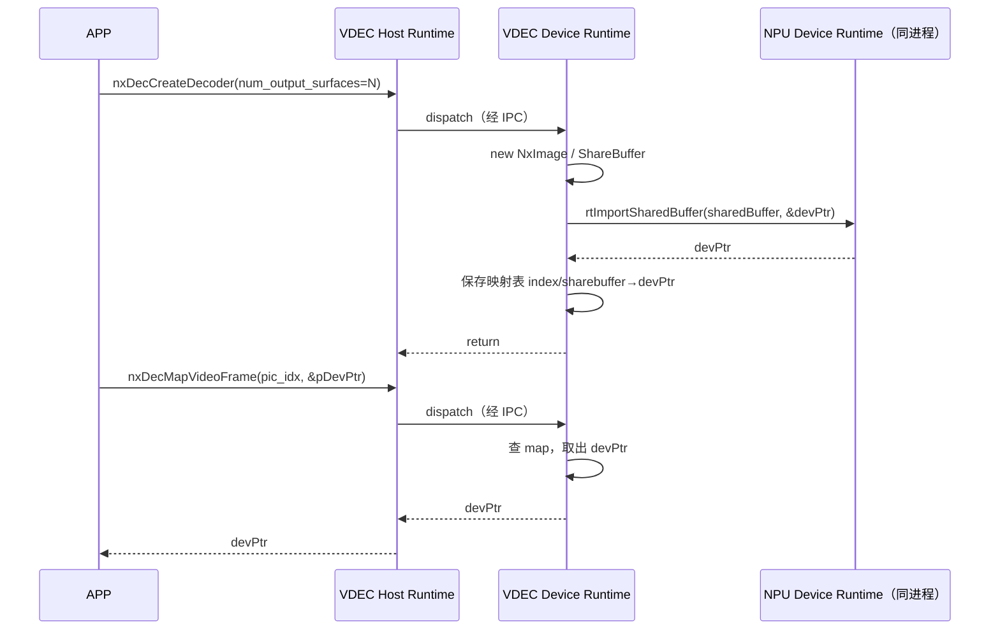
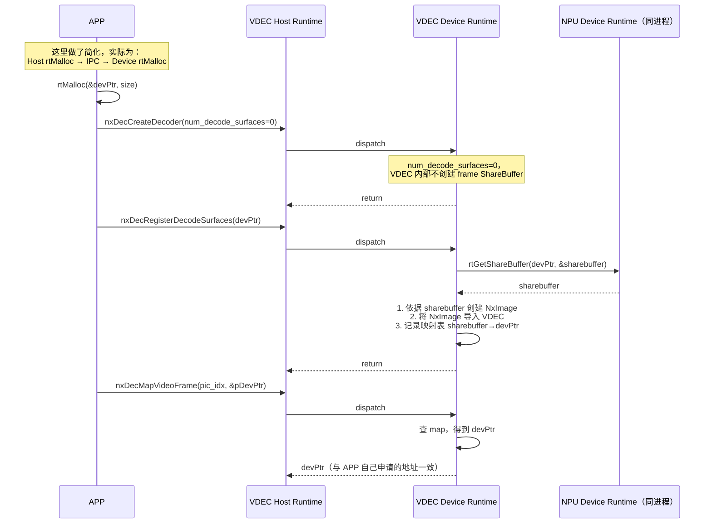
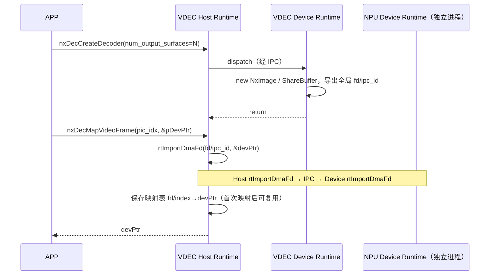
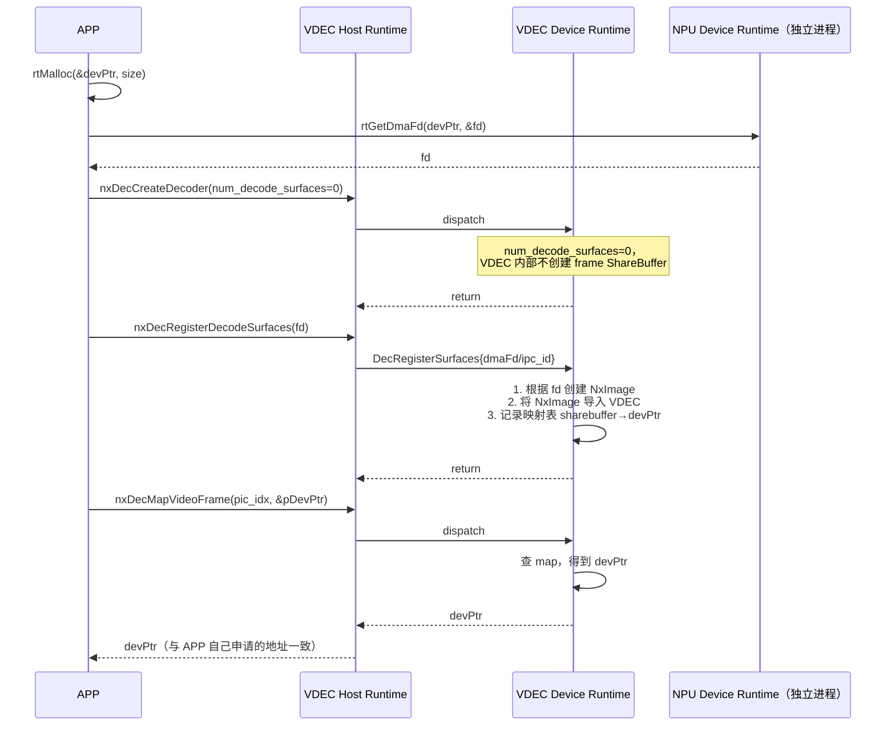
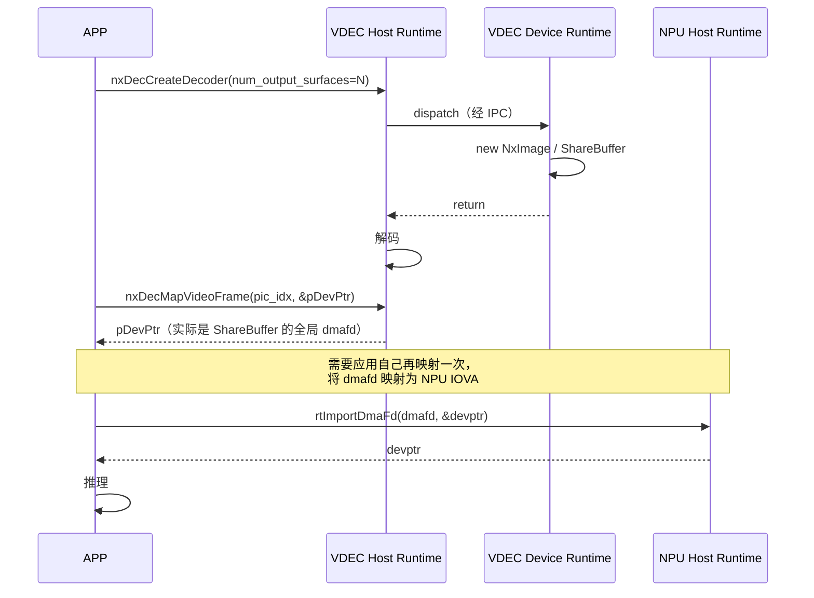
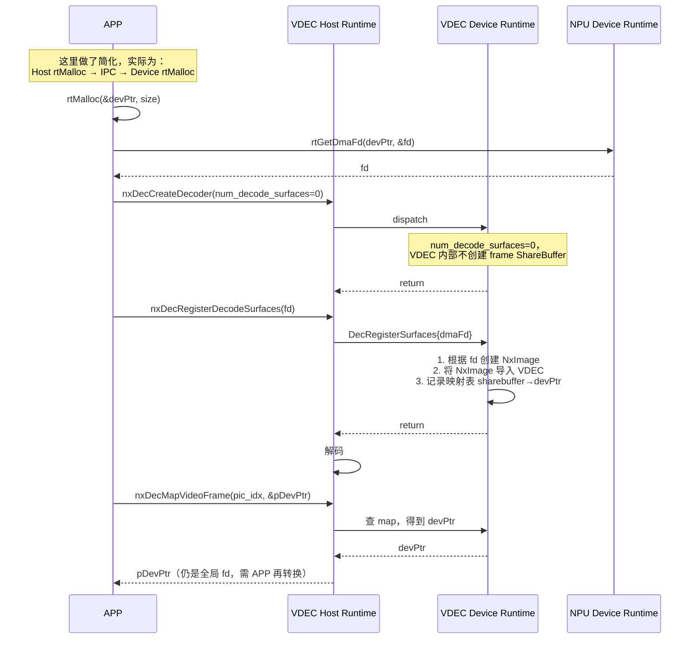

# 推理卡编解码方案对齐：以 NxVdec 对齐 NVIDIA NVDEC 为例

> 本文整理自内部技术方案文档《推理卡编解码方案对齐》，在保留原始设计意图的基础上，重新组织了章节结构、修复了 PDF 转换过程中丢失的代码格式与表格排版，并对 **「方案设计」** 一节做了重点补充：明确了每个方案的必要条件、优缺点矩阵、以及在不同部署形态下的选型建议。文中 `NxVdec` / `nxDec*` / `rt*` 为占位性接口命名，代指某款自研 AI 推理卡（NPU）上的视频解码模块与运行时接口，用于与 NVIDIA NVDEC 做能力和语义对齐；实际项目中请替换为真实的产品接口名。

## 阅读指引

- **[1. 解码](#1-解码)**：先看 NVIDIA NVDEC 的接口与架构（1.1），再看 NxVdec 如何对齐（1.2），然后是逐接口对比（1.3）。
- **[1.4 方案设计](#14-方案设计npu-与-codec-的显存互操作设计)**：本文重点。围绕「`cuvidMapVideoFrame` 语义对齐」与「零拷贝」两个核心问题，给出四种候选方案的架构、必要条件、优缺点对比，并附选型建议。
- **[2. 编码](#2-编码)** 与 **[3. 总结](#3-总结)**：原文档中对应章节仅有标题、暂无正文内容，本次整理未做内容补充，标记为待续，避免向文档中混入未经验证的编码（NVENC/NxVenc）设计信息。

---

## 1. 解码

### 1.1 英伟达解码

#### 1.1.1 架构

NVIDIA GPU 的硬件视频解码由**独立于 CUDA Core 的固定功能引擎 NVDEC** 完成，软件侧通过 NVDECODE API（`cuviddec.h` + `nvcuvid.h`）暴露为两个解耦的组件：

- **Video Parser**（软件，`CUvideoparser`）：逐包吃码流（NALU/OBU），做 SPS/PPS 解析、参考帧管理、显示顺序重排，通过三个回调把关键事件推给应用。
- **Video Decoder**（硬件，`CUvideodecoder`）：真正驱动 NVDEC 硬件完成熵解码、变换反量化、运动补偿、环路滤波，解码结果落在一组内部管理的 Decode Surface（DPB）里。

两者都在应用所在的同一个 CUDA Context / 进程内直接调用驱动完成，没有额外的进程间通信开销：



这个「同进程直调驱动」的架构，是后面 1.3、1.4 节里 NxVdec 与 NVIDIA 语义差异的根本原因之一：NxVdec 的 Parser/Decoder 之间往往隔着 Host/Device 两个进程和一层 IPC（见 1.2.1），而不是像 NVIDIA 一样在同一进程内直接持有 CUDA 显存指针。

#### 1.1.2 英伟达接口及示例

**VideoParser**（`nvcuvid.h`）：负责码流解析与回调分发。

**Vdec**（`cuviddec.h`）：负责解码器创建、图片提交、帧映射等硬件相关操作。

##### 示例 1：非零拷贝方式

解码器内部自行分配 Output Surface，应用通过 `cuvidMapVideoFrame` 拿到的是解码器内部显存的映射指针：

```cpp
#include <cuda.h>
#include <cuviddec.h>
#include <nvcuvid.h>
#include <iostream>
#include <vector>

// 全局解码器句柄，实际项目中建议封装在类中
CUvideodecoder g_hDecoder = nullptr;

// 回调 1：处理视频序列（如 SPS/PPS），在这里创建/重配解码器
int CUDAAPI HandleVideoSequence(void* pUserData, CUVIDEOFORMAT* pFormat) {
    std::cout << "视频序列回调: 分辨率 " << pFormat->coded_width
              << "x" << pFormat->coded_height << std::endl;

    CUVIDDECODECREATEINFO createInfo = {0};
    createInfo.ulWidth              = pFormat->coded_width;
    createInfo.ulHeight             = pFormat->coded_height;
    createInfo.ulNumDecodeSurfaces  = pFormat->min_num_decode_surfaces; // DPB 大小
    createInfo.ulNumOutputSurfaces  = 2;   // 同时 map 几张 output
    createInfo.CodecType            = pFormat->codec;
    createInfo.ulCreationFlags      = cudaVideoCreate_PreferCUVID; // 优先使用 CUVID
    // ... 设置其他参数，如输出格式等

    // 如果已有解码器，先销毁再创建（处理分辨率变化）
    if (g_hDecoder) {
        cuvidDestroyDecoder(g_hDecoder);
        g_hDecoder = nullptr;
    }

    CUresult result = cuvidCreateDecoder(&g_hDecoder, &createInfo);
    if (result != CUDA_SUCCESS) {
        std::cerr << "创建解码器失败" << std::endl;
        return 0;
    }
    return 1;
}

// 回调 2：解码一帧图像，调用硬件解码
int CUDAAPI HandlePictureDecode(void* pUserData, CUVIDPICPARAMS* pPicParams) {
    // 将解析好的图片参数送入解码器
    // pPicParams->CurrPicIdx 是 DPB 槽位，也是后续 Map 要用的 nPicIdx
    CUresult result = cuvidDecodePicture(g_hDecoder, pPicParams);
    if (result != CUDA_SUCCESS) {
        std::cerr << "解码图片失败" << std::endl;
        return 0;
    }
    return 1;
}

// 回调 3：显示/处理一帧图像，在这里取出解码后的数据
int CUDAAPI HandlePictureDisplay(void* pUserData, CUVIDPARSERDISPINFO* pDispInfo) {
    CUVIDPROCPARAMS procParams = {0};
    unsigned long long devPtr   = 0; // CUDA 设备指针
    int pitch                   = 0;

    // 将解码后的帧映射到 CUDA 可访问的内存
    // pDispInfo->picture_index 指出 DPB 中哪个槎位已经可以 display 了
    CUresult result = cuvidMapVideoFrame(g_hDecoder, pDispInfo->picture_index,
                                          &devPtr, &pitch, &procParams);
    if (result != CUDA_SUCCESS) {
        std::cerr << "映射视频帧失败" << std::endl;
        return 0;
    }

    // --- 在这里进行 CUDA 处理或拷贝到 CPU ---
    // 例如：调用 CUDA 核函数对 devPtr 指向的 YUV 数据进行处理
    //   myCudaKernel<<<grid, block>>>(devPtr, pitch, width, height);
    //   进行颜色空间转换 (YUV to RGB)、缩放、AI 推理等
    // 或者：将结果从 GPU 拷贝回 CPU
    //   unsigned char* hostPtr = nullptr;
    //   cuMemAllocHost(&hostPtr, frameSize);
    //   cuMemcpyDtoH(hostPtr, devPtr, frameSize);

    std::cout << "显示回调: 帧索引 " << pDispInfo->picture_index
              << ", 设备指针 " << devPtr << ", pitch " << pitch << std::endl;

    // 处理完成后，必须取消映射
    cuvidUnmapVideoFrame(g_hDecoder, devPtr);
    return 1;
}

int main() {
    // 1. 初始化 CUDA 上下文（此处省略具体代码）
    // CUcontext cuContext = ...;

    // 2. 设置解析器参数，绑定回调函数
    CUVIDPARSERPARAMS parserParams   = {0};
    parserParams.CodecType           = cudaVideoCodec_H264; // 假设是 H.264 码流
    parserParams.ulMaxNumDecodeSurfaces = 8;
    parserParams.pfnSequenceCallback = HandleVideoSequence;
    parserParams.pfnDecodePicture    = HandlePictureDecode;
    parserParams.pfnDisplayPicture    = HandlePictureDisplay;
    // pUserData 可以传递自定义数据，这里设为 nullptr

    // 3. 创建视频解析器
    CUvideoparser hParser = nullptr;
    CUresult result = cuvidCreateVideoParser(&hParser, &parserParams);
    if (result != CUDA_SUCCESS) {
        std::cerr << "创建视频解析器失败" << std::endl;
        return -1;
    }

    // 4. 模拟从视频文件中读取数据并送入解析器
    // 实际应用中，数据来自文件、网络流（如 RTSP）或内存
    std::vector<uint8_t> fileData = readVideoFile("input.h264"); // 假设有此函数
    size_t offset = 0;
    while (offset < fileData.size()) {
        // 假设能找到每个 NAL 单元的起始和长度（实际需解析 NAL 单元）
        size_t naluSize = findNextNaluSize(fileData, offset); // 假设有此函数
        if (naluSize == 0) break;

        // 准备数据包
        CUVIDSOURCEDATAPACKET packet = {0};
        packet.payload      = fileData.data() + offset;
        packet.payload_size = naluSize;
        // 如果是最后一个包，设置结束标志
        // packet.flags |= CUVID_PKT_ENDOFSTREAM;

        // 将数据包送入解析器，这是驱动整个解码流程的核心调用
        result = cuvidParseVideoData(hParser, &packet);
        if (result != CUDA_SUCCESS) {
            std::cerr << "解析视频数据失败" << std::endl;
            break;
        }
        offset += naluSize;
    }

    // 5. 发送空包，通知解析器码流结束
    CUVIDSOURCEDATAPACKET endPacket = {0};
    endPacket.flags = CUVID_PKT_ENDOFSTREAM;
    cuvidParseVideoData(hParser, &endPacket);

    // 6. 清理资源
    if (g_hDecoder) {
        cuvidDestroyDecoder(g_hDecoder);
    }
    if (hParser) {
        cuvidDestroyVideoParser(hParser);
    }
    // 清理 CUDA 上下文...
    return 0;
}
```

##### 示例 2：零拷贝方式（framebuffer 外部创建）

应用先自行创建 CUDA Array 作为外部 framebuffer，再注册进解码器内部，解码结果直接写到这块由应用管理的显存上，避免解码器再分配/拷贝一份：

```cpp
// 1. 应用侧创建外部 framebuffer（CUDA Array）
CUDA_ARRAY3D_DESCRIPTOR desc = {};
desc.Width       = alignedWidth;
desc.Height      = alignedHeight;
desc.Depth       = 0;
desc.NumChannels = 3;
desc.Format      = CU_AD_FORMAT_NV12;  // 或 P016 / NV16 / P216
desc.Flags       = CUDA_ARRAY3D_SURFACE_LDST | CUDA_ARRAY3D_VIDEO_ENCODE_DECODE;

CUarray array;
cuArray3DCreate(&array, &desc);

// 2. 将外部创建的 framebuffer 注册进解码器（具体签名以对应版本 SDK 头文件为准）
cuvidRegisterDecodeSurfaces(/* ... */);

// 3. 用一条独立的 CUDA Stream，把「解码」和「后续处理」串成异步流水线
CUstream stream;
cuStreamCreate(&stream, CU_STREAM_NON_BLOCKING);

// 提交第 N 帧给 NVDEC 解码，并让它和 stream 同步
cuvidDecodePictureAsync(decoder, picParamsN, stream);

// 后续 CUDA kernel 放到同一个 stream，它会在第 N 帧解码完成后再执行
ResizeOrConvertKernel<<<grid, block, 0, stream>>>(/* ... */);

// 再提交下一帧，形成 decode(N+1) 与 kernel(N) 的流水重叠
cuvidDecodePictureAsync(decoder, picParamsN1, stream);
```

> `cuvidRegisterDecodeSurfaces` / `cuvidDecodePictureAsync` 依赖具体 Video Codec SDK 版本，使用前请核对目标 SDK 的 `cuviddec.h` 确认实际签名与能力边界。

---

### 1.2 NxVdec

#### 1.2.1 架构（对齐英伟达）

NxVdec 在**接口语义**上对齐 NVIDIA：同样拆分成软件 Parser（`nxDecVideoParser`）和硬件 Decoder（`nxDecDecoderHandle`），同样用三个回调（`pfn_sequence_callback` / `pfn_decode_picture` / `pfn_display_picture`）驱动流程。

但在**实现拓扑**上，NxVdec 与 NVIDIA 有一个关键差异：NVIDIA 的 Parser 和 Decoder 都在应用所在的同一个进程内直接调驱动；而 NxVdec 的硬件解码引擎运行在独立的 Device 侧进程里，Host 侧的 `nxDec*` 调用需要经过一层 **IPC** 才能到达 Device 侧的解码后端（VDECBackend / SOC VDEC 硬件 + NPURT）：



正是这个 **「Host/Device 分离 + IPC」** 的拓扑，让「`cuvidMapVideoFrame` 语义对齐」和「零拷贝」这两个问题在 NxVdec 上比在 NVIDIA 上复杂得多——NVIDIA 的 `pDevPtr` 是同进程内的 CUDA 指针，拿来即用；NxVdec 的 `pDevPtr` 要跨越 Device 侧的 VDEC 进程和 NPU 进程（是否为同一进程取决于部署形态），才能变成一个 NPU 真正可用的地址。这正是 1.4 节四个方案的分歧点。

#### 1.2.2 NxVdec 接口及示例

**nxParser**（`nxparser.h`）、**Nxvdec**（`nxvdec.h`）：接口形态与 NVIDIA 的 VideoParser / Vdec 一一对应（详见 1.3 对比表）。

##### 示例 1：非零拷贝方式

解码器内部自行创建 `num_output_surfaces` 张输出帧，`nxDecMapVideoFrame` 返回的是解码器内部管理显存的映射地址：

```c
#include "nxparser.h"
#include "nxvdec.h"
#include "sample_clip.h"
#include <stdint.h>
#include <stdio.h>
#include <string.h>

typedef struct App {
    nxDecDecoderHandle decoder;
    nxDecStatus status;
} App;

static void fill_decoder_info(nxDecDecoderCreateInfo *info,
                               const nxDecVideoFormat *fmt)
{
    memset(info, 0, sizeof(*info));
    info->codec_type          = fmt->codec;
    info->chroma_format       = fmt->chroma_format;
    info->bit_depth_minus_8   = fmt->bit_depth_luma_minus8;
    info->width               = fmt->coded_width;
    info->height               = fmt->coded_height;
    info->max_width            = fmt->coded_width;
    info->max_height           = fmt->coded_height;
    info->num_decode_surfaces  = fmt->min_num_decode_surfaces
                                      ? fmt->min_num_decode_surfaces
                                      : 4;
    info->output_format        = nxDecVideoSurfaceFormat_NV12;
    info->target_width          = fmt->coded_width;
    info->target_height         = fmt->coded_height;
    info->num_output_surfaces   = 1;
    info->display_rect.right    = (int16_t)fmt->coded_width;
    info->display_rect.bottom   = (int16_t)fmt->coded_height;
}

static int on_sequence(void *user_data, nxDecVideoFormat *fmt)
{
    App *app = (App *)user_data;
    nxDecDecoderCreateInfo info;
    fill_decoder_info(&info, fmt);

    if (app->decoder == NULL) {
        app->status = nxDecCreateDecoder(&app->decoder, &info);
    } else {
        nxDecReconfigureDecoderInfo reconf;
        memset(&reconf, 0, sizeof(reconf));
        reconf.width                 = info.width;
        reconf.height                = info.height;
        reconf.target_width          = info.target_width;
        reconf.target_height         = info.target_height;
        reconf.num_decode_surfaces   = info.num_decode_surfaces;
        reconf.bit_depth_minus_8     = info.bit_depth_minus_8;
        reconf.display_rect          = info.display_rect;
        app->status = nxDecReconfigureDecoder(app->decoder, &reconf);
    }

    if (app->status != NXDEC_SUCCESS) {
        return 0;
    }
    return (int)info.num_decode_surfaces;
}

static int on_decode(void *user_data, nxDecPicParams *pic)
{
    App *app = (App *)user_data;
    app->status = nxDecDecodePicture(app->decoder, pic);
    return app->status == NXDEC_SUCCESS ? 1 : 0;
}

static int on_display(void *user_data, nxDecParserDispInfo *disp)
{
    App *app = (App *)user_data;
    unsigned long long dev_ptr = 0;
    unsigned int pitch = 0;
    nxDecVideoProcessParams proc;
    memset(&proc, 0, sizeof(proc));
    proc.progressive_frame = disp->progressive_frame;
    proc.top_field_first    = disp->top_field_first;

    app->status = nxDecMapVideoFrame(app->decoder, disp->picture_index,
                                      &dev_ptr, &pitch, &proc);
    if (app->status != NXDEC_SUCCESS) {
        return 0;
    }

    printf("internal frame ready: pic=%d, ptr=0x%llx, pitch=%u, pts=%lld\n",
           disp->picture_index, (unsigned long long)dev_ptr, pitch,
           (long long)disp->pts);

    app->status = nxDecUnmapVideoFrame(app->decoder, dev_ptr);
    return app->status == NXDEC_SUCCESS ? 1 : 0;
}

static void destroy_app(App *app, nxDecVideoParser parser)
{
    if (parser) {
        nxDecDestroyVideoParser(parser);
    }
    if (app->decoder) {
        nxDecDestroyDecoder(app->decoder);
        app->decoder = NULL;
    }
}

int main(void)
{
    App app;
    nxDecParserParams parser_params;
    nxDecVideoParser parser = NULL;
    nxDecSourceDataPacket packet;

    memset(&app, 0, sizeof(app));
    memset(&parser_params, 0, sizeof(parser_params));
    app.status = NXDEC_SUCCESS;

    parser_params.codec_type              = nxDecCodec_HEVC;
    parser_params.max_num_decode_surfaces  = 4;
    parser_params.max_display_delay        = 0;
    parser_params.annex_b                  = 1;
    parser_params.user_data                = &app;
    parser_params.pfn_sequence_callback    = on_sequence;
    parser_params.pfn_decode_picture       = on_decode;
    parser_params.pfn_display_picture      = on_display;

    if (nxDecCreateVideoParser(&parser, &parser_params) != NXDEC_SUCCESS) {
        return 1;
    }

    memset(&packet, 0, sizeof(packet));
    packet.payload      = (uint8_t *)kSampleHevcClip;
    packet.payload_size = (uint32_t)kSampleHevcClipSize;
    packet.pts          = 1000;
    packet.flags        = NXDEC_PKT_TIMESTAMP | NXDEC_PKT_ENDOFPICTURE;
    if (nxDecParseVideoData(parser, &packet) != NXDEC_SUCCESS ||
        app.status != NXDEC_SUCCESS) {
        destroy_app(&app, parser);
        return 2;
    }

    memset(&packet, 0, sizeof(packet));
    packet.flags = NXDEC_PKT_ENDOFSTREAM | NXDEC_PKT_NOTIFY_EOS;
    if (nxDecParseVideoData(parser, &packet) != NXDEC_SUCCESS ||
        app.status != NXDEC_SUCCESS) {
        destroy_app(&app, parser);
        return 3;
    }

    destroy_app(&app, parser);
    return 0;
}
```

##### 示例 2：零拷贝方式

与示例 1 的核心差异：`num_decode_surfaces` 传 0，解码器内部**不**创建帧缓冲；应用自行通过 NPU Runtime 分配显存（`rtMalloc`），再用 `nxDecRegisterDecodeSurfaces` 把这些显存注册给解码器，解码结果直接写入应用自己持有的这块显存：

```c
#include "nxparser.h"
#include "nxvdec.h"
#include "npu_runtime_api.h"
#include "sample_clip.h"
#include <stdint.h>
#include <stdio.h>
#include <stdlib.h>
#include <string.h>

typedef struct App {
    nxDecDecoderHandle decoder;
    uint64_t *decode_surfaces;
    uint32_t num_decode_surfaces;
    uint32_t decode_width;
    uint32_t decode_height;
    uint32_t decode_bit_depth_minus_8;
    nxDecVideoSurfaceFormat output_format;
    nxDecStatus status;
} App;

static uint64_t decode_surface_size(uint32_t width, uint32_t height,
                                     uint32_t bit_depth_minus_8)
{
    uint64_t bytes_per_sample = bit_depth_minus_8 ? 2u : 1u;
    uint64_t stride = ((uint64_t)width * bytes_per_sample + 63u) & ~63u;
    return stride * height + stride * ((height + 1u) / 2u); // NV12: Y + UV/2
}

static void fill_decoder_info(nxDecDecoderCreateInfo *info,
                               const nxDecVideoFormat *fmt)
{
    memset(info, 0, sizeof(*info));
    info->codec_type           = fmt->codec;
    info->chroma_format        = fmt->chroma_format;
    info->bit_depth_minus_8    = fmt->bit_depth_luma_minus8;
    info->width                = fmt->coded_width;
    info->height               = fmt->coded_height;
    info->max_width             = fmt->coded_width;
    info->max_height            = fmt->coded_height;
    info->num_decode_surfaces   = 0; // 零拷贝：由应用自行分配，交给 VDEC 之前先置 0
    info->output_format         = nxDecVideoSurfaceFormat_NV12;
    info->target_width           = fmt->coded_width;
    info->target_height          = fmt->coded_height;
    info->num_output_surfaces    = 1;
    info->display_rect.right     = (int16_t)fmt->coded_width;
    info->display_rect.bottom    = (int16_t)fmt->coded_height;
}

static void release_decode_surfaces(App *app)
{
    if (app->decode_surfaces) {
        for (uint32_t i = 0; i < app->num_decode_surfaces; ++i) {
            if (app->decode_surfaces[i]) {
                rtFree((void *)(uintptr_t)app->decode_surfaces[i]);
            }
        }
        free(app->decode_surfaces);
    }
    app->decode_surfaces           = NULL;
    app->num_decode_surfaces       = 0;
    app->decode_width              = 0;
    app->decode_height             = 0;
    app->decode_bit_depth_minus_8  = 0;
    app->output_format             = nxDecVideoSurfaceFormat_NV12;
}

static nxDecStatus ensure_decode_surfaces(App *app,
                                           const nxDecDecoderCreateInfo *info,
                                           uint32_t surface_count)
{
    if (app->decode_surfaces &&
        app->num_decode_surfaces == surface_count &&
        app->decode_width == info->width &&
        app->decode_height == info->height &&
        app->decode_bit_depth_minus_8 == info->bit_depth_minus_8 &&
        app->output_format == info->output_format) {
        return NXDEC_SUCCESS; // 复用已有分配
    }

    release_decode_surfaces(app);
    app->decode_surfaces = (uint64_t *)calloc(surface_count,
                                               sizeof(*app->decode_surfaces));
    if (app->decode_surfaces == NULL) {
        return NXDEC_OUTOF_MEMORY;
    }

    uint64_t surface_size = decode_surface_size(info->width, info->height,
                                                 info->bit_depth_minus_8);
    for (uint32_t i = 0; i < surface_count; ++i) {
        void *surface = NULL;
        if (rtMalloc(&surface, (size_t)surface_size) != NX_STATUS_OK) {
            release_decode_surfaces(app);
            return NXDEC_OUTOF_MEMORY;
        }
        app->decode_surfaces[i] = (uint64_t)(uintptr_t)surface;
        ++app->num_decode_surfaces;
    }

    app->decode_width             = info->width;
    app->decode_height            = info->height;
    app->decode_bit_depth_minus_8 = info->bit_depth_minus_8;
    app->output_format            = info->output_format;
    return NXDEC_SUCCESS;
}

static nxDecStatus register_decode_surfaces(App *app)
{
    nxDecRegisterDecodeSurfacesInfo surfaces_info;
    memset(&surfaces_info, 0, sizeof(surfaces_info));

    uint64_t bytes_per_sample = app->decode_bit_depth_minus_8 ? 2u : 1u;
    uint64_t stride = ((uint64_t)app->decode_width * bytes_per_sample + 63u) & ~63u;

    surfaces_info.num_decode_surfaces = app->num_decode_surfaces;
    surfaces_info.width                = app->decode_width;
    surfaces_info.height               = app->decode_height;
    surfaces_info.output_format        = (uint32_t)app->output_format;
    surfaces_info.bit_depth_minus_8     = app->decode_bit_depth_minus_8;
    surfaces_info.pitch                 = (uint32_t)stride;
    surfaces_info.surface_bytes         = decode_surface_size(
        app->decode_width, app->decode_height, app->decode_bit_depth_minus_8);
    surfaces_info.decode_surfaces       = app->decode_surfaces;

    // 关键调用：把应用自己 rtMalloc 出来的显存注册给解码器，实现零拷贝
    return nxDecRegisterDecodeSurfaces(app->decoder, &surfaces_info);
}

static void destroy_decoder(App *app)
{
    if (app->decoder) {
        nxDecDestroyDecoder(app->decoder);
        app->decoder = NULL;
    }
    release_decode_surfaces(app);
}

static nxDecStatus create_decoder(App *app, const nxDecDecoderCreateInfo *info,
                                   uint32_t surface_count)
{
    nxDecStatus status = nxDecCreateDecoder(&app->decoder, info);
    if (status != NXDEC_SUCCESS) {
        app->status = status;
        return status;
    }

    status = ensure_decode_surfaces(app, info, surface_count);
    if (status != NXDEC_SUCCESS) {
        destroy_decoder(app);
        app->status = status;
        return status;
    }

    status = register_decode_surfaces(app);
    if (status != NXDEC_SUCCESS) {
        destroy_decoder(app);
        app->status = status;
        return status;
    }

    app->status = NXDEC_SUCCESS;
    return NXDEC_SUCCESS;
}

static int on_sequence(void *user_data, nxDecVideoFormat *fmt)
{
    App *app = (App *)user_data;
    nxDecDecoderCreateInfo info;
    fill_decoder_info(&info, fmt);

    uint32_t surface_count = fmt->min_num_decode_surfaces
                                  ? fmt->min_num_decode_surfaces
                                  : 4;
    info.num_decode_surfaces = surface_count;

    if (app->decoder) {
        if (app->decode_width != info.width ||
            app->decode_height != info.height ||
            app->output_format != info.output_format) {
            destroy_decoder(app);
            app->status = create_decoder(app, &info, surface_count);
        }
    } else {
        app->status = create_decoder(app, &info, surface_count);
    }

    if (app->status != NXDEC_SUCCESS) {
        return 0;
    }
    return (int)app->num_decode_surfaces;
}

static int on_decode(void *user_data, nxDecPicParams *pic)
{
    App *app = (App *)user_data;
    app->status = nxDecDecodePicture(app->decoder, pic);
    return app->status == NXDEC_SUCCESS ? 1 : 0;
}

static int on_display(void *user_data, nxDecParserDispInfo *disp)
{
    App *app = (App *)user_data;
    unsigned long long mapped_ptr = 0;
    unsigned int pitch = 0;
    nxDecVideoProcessParams proc;
    memset(&proc, 0, sizeof(proc));
    proc.progressive_frame = disp->progressive_frame;
    proc.top_field_first    = disp->top_field_first;

    app->status = nxDecMapVideoFrame(app->decoder, disp->picture_index,
                                      &mapped_ptr, &pitch, &proc);
    if (app->status != NXDEC_SUCCESS) {
        return 0;
    }

    // 零拷贝场景下，这里拿到的 mapped_ptr 应与 APP 自己 rtMalloc 出来的地址一致
    printf("external frame ready: pic=%d, ptr=0x%llx, pitch=%u, pts=%lld\n",
           disp->picture_index, mapped_ptr, pitch, (long long)disp->pts);

    app->status = nxDecUnmapVideoFrame(app->decoder, mapped_ptr);
    return app->status == NXDEC_SUCCESS ? 1 : 0;
}

static void destroy_app(App *app, nxDecVideoParser parser)
{
    if (parser) {
        nxDecDestroyVideoParser(parser);
    }
    destroy_decoder(app);
}

int main(void)
{
    App app;
    nxDecParserParams parser_params;
    nxDecVideoParser parser = NULL;
    nxDecSourceDataPacket packet;

    memset(&app, 0, sizeof(app));
    memset(&parser_params, 0, sizeof(parser_params));
    app.status = NXDEC_SUCCESS;

    parser_params.codec_type             = nxDecCodec_HEVC;
    parser_params.max_num_decode_surfaces = 4;
    parser_params.max_display_delay       = 0;
    parser_params.annex_b                 = 1;
    parser_params.user_data               = &app;
    parser_params.pfn_sequence_callback   = on_sequence;
    parser_params.pfn_decode_picture      = on_decode;
    parser_params.pfn_display_picture     = on_display;

    if (nxDecCreateVideoParser(&parser, &parser_params) != NXDEC_SUCCESS) {
        return 1;
    }

    memset(&packet, 0, sizeof(packet));
    packet.payload      = (uint8_t *)kSampleHevcClip;
    packet.payload_size = (uint32_t)kSampleHevcClipSize;
    packet.pts          = 1000;
    packet.flags        = NXDEC_PKT_TIMESTAMP | NXDEC_PKT_ENDOFPICTURE;
    if (nxDecParseVideoData(parser, &packet) != NXDEC_SUCCESS ||
        app.status != NXDEC_SUCCESS) {
        destroy_app(&app, parser);
        return 2;
    }

    memset(&packet, 0, sizeof(packet));
    packet.flags = NXDEC_PKT_ENDOFSTREAM | NXDEC_PKT_NOTIFY_EOS;
    if (nxDecParseVideoData(parser, &packet) != NXDEC_SUCCESS ||
        app.status != NXDEC_SUCCESS) {
        destroy_app(&app, parser);
        return 3;
    }

    destroy_app(&app, parser);
    return 0;
}
```

#### 1.2.3 NxVdec 运行视图

> 下面两张顺序图基于原始设计稿件整理重绘，聚焦关键调用链与数据搬运路径；组件命名沿用原稿（`VdecHost`/`VdecDevice`/`IPCHost`/`IPCDevice`/`VDECBackend`/`SOC VDEC` 等），细粒度的内部私有调用做了适当合并。

##### 非零拷贝运行视图

`VdecParser` 和 `VdecHost` 是对外接口模块；解码器内部自行创建 `num_output_surfaces` 张 `NxImage`，码流数据需要先在 Host 侧落到 DMA Heap，再通过 IPC 做一次 DMA 拷贝搬到 Device 侧：



##### 零拷贝运行视图

与非零拷贝的差异集中在解码器创建与帧缓冲来源：`num_decode_surfaces=0` 时 VDEC 内部不再创建自己的 `ShareBuffer`，改为消费应用通过 `nxDecRegisterDecodeSurfaces` 注册进来的显存：



---

### 1.3 英伟达与 NxVdec 接口对比

| 英伟达 | NX | 备注 |
| :--- | :--- | :--- |
| **VideoParser（解析功能）** | | |
| `cuvidCreateVideoParser(CUvideoparser* pObj, CUVIDPARSERPARAMS* pParams)` | `nxDecCreateVideoParser(nxDecVideoParser* parser_handle, nxDecParserParams* params)` | 接口函数一致。`nxDecParserParams` 都是通过三个回调函数调用；`CUVIDPARSERPARAMS` 成员变量比 `nxDecParserParams` 丰富。 |
| `cuvidParseVideoData(CUvideoparser obj, CUVIDSOURCEDATAPACKET* pPacket)` | `nxDecParseVideoData(nxDecVideoParser parser_handle, nxDecSourceDataPacket* packet)` | 接口函数一致；Packet 数据结构及成员变量一致；接收 Host CPU 侧的码流。 |
| `cuvidDestroyVideoParser(CUvideoparser obj)` | `nxDecDestroyVideoParser(nxDecVideoParser parser_handle)` | 接口函数一致。 |
| **Vdec（解码功能）** | | |
| `cuvidCreateDecoder(CUvideodecoder* phDecoder, CUVIDDECODECREATEINFO* pdci)` | `nxDecCreateDecoder(nxDecDecoderHandle* decoder_handle, const nxDecDecoderCreateInfo* create_info)` | 接口函数一致。`num_decode_surfaces`：英伟达用作 DPB buffer 配置，对 Nx 无意义；`num_output_surfaces`：英伟达用作 output buffer 配置，Nx 侧约定为 `num_output_surfaces = min_dpb_num + N`。 |
| `cuvidDestroyDecoder(CUvideodecoder hDecoder)` | `nxDecDestroyDecoder(nxDecDecoderHandle decoder_handle)` | 接口函数一致。 |
| `cuvidDecodePicture(CUvideodecoder hDecoder, CUVIDPICPARAMS* pPicParams)` | `nxDecDecodePicture(nxDecDecoderHandle decoder_handle, nxDecPicParams* pic_params)` | 接口一致；`nxDecPicParams.curr_pic_idx` 对 Nx codec 无实际意义。 |
| `cuvidMapVideoFrame(CUvideodecoder hDecoder, int nPicIdx, unsigned int* pDevPtr, unsigned int* pPitch, CUVIDPROCPARAMS* pVPP)` | `nxDecMapVideoFrame(nxDecDecoderHandle decoder_handle, int pic_idx, unsigned long long* pDevPtr, unsigned int* pPitch, nxDecVideoProcessParams* video_process_params)` | 接口函数一致；**`pDevPtr` 应为 NPU IOVA**——这正是 1.4 节要解决的核心语义问题。 |
| `cuvidUnmapVideoFrame(CUvideodecoder hDecoder, unsigned int DevPtr)` | `nxDecUnmapVideoFrame(nxDecDecoderHandle decoder_handle, unsigned long long DevPtr)` | 接口函数一致。 |
| `cuvidGetDecodeStatus(CUvideodecoder hDecoder, int nPicIdx, CUVIDGETDECODESTATUS* pDecodeStatus)` | `nxDecGetDecodeStatus(nxDecDecoderHandle decoder_handle, int pic_idx, nxDecDecodeStatus* decode_status)` | 接口函数一致。 |
| `cuvidGetDecoderCaps(CUVIDDECODECAPS* pdc)` | `nxDecGetDecoderCaps(nxDecDecodeCaps* decode_caps)` | 接口函数一致。 |
| `cuvidReconfigureDecoder(CUvideodecoder hDecoder, CUVIDRECONFIGUREDECODERINFO* pDecReconfigParams)` | `nxDecReconfigureDecoder(nxDecDecoderHandle decoder_handle, nxDecReconfigureDecoderInfo* reconf_info)` | 接口函数一致。 |
| `cuvidDecodePictureAsync(CUvideodecoder hDecoder, CUVIDPICPARAMS* pPicParams, CUstream strm)` | 不支持 | NxVdec 当前无异步 Stream 语义的对应接口。 |

---

## 1.4 方案设计（NPU 与 Codec 的显存互操作设计）

### 1.4.1 待解决的问题

对齐 NVIDIA VDEC 语义，当前面临两个核心问题：

1. **`cuvidMapVideoFrame` 的指针语义**：NVIDIA 的 `cuvidMapVideoFrame(CUvideodecoder hDecoder, int nPicIdx, unsigned int* pDevPtr, unsigned int* pPitch, CUVIDPROCPARAMS* pVPP)` 返回的 `pDevPtr` 是 CUDA 显存 IOVA，应用拿到后**可以直接送给 CUDA 函数使用**，不需要任何二次转换。NxVdec 要对齐这一点：`nxDecMapVideoFrame` 返回的 `pDevPtr` 也必须是 NPU 侧可以直接寻址、直接使用的合法设备地址。
2. **零拷贝**：NVIDIA 支持应用通过 `cuArray3DCreate(&array, &desc)` 在 CUDA 侧创建外部 framebuffer，再通过 `cuvidRegisterDecodeSurfaces(CUvideodecoder hDecoder, CUVIDREGISTERDECODESURFACESINFO* pDecSurfInfo)` 把这块显存导入解码器内部，解码结果直接写到应用管理的这块显存上，全程「解码 → 推理/编码」无需额外拷贝。NxVdec 需要提供等价能力。

这两个问题的共同根源是：**VDEC（视频解码器）与 NPU（推理引擎）的显存分配、地址空间分别由两套独立的 Runtime 管理**（见 1.2.1 的 Host/Device 拓扑），如何在不破坏两套 Runtime 各自安全边界的前提下，让同一块物理显存对两者都可寻址，是下面所有方案要回答的根本问题。

### 1.4.2 方案评估维度

结合原方案对比表，评估时建议统一看四个维度：

- **语义正确性**：`pDevPtr` 拿到手能否直接用（是否符合 NVDEC 语义）。
- **部署形态要求**：是否要求 NPU Device Runtime 与 Codec(VDEC) Device Runtime 部署在同一进程（"共进程"）——直接决定能否支持容器化隔离部署。
- **接口侵入性**：对现有 `ShareBuffer` / `NxImage` 数据结构是否需要新增/修改接口。
- **下游能力完整性**：`pDevPtr` 是否是一个真正的设备地址，能否支撑 `rtMemcpy` 等 D2D/D2H 拷贝操作。

### 1.4.3 四种候选方案

#### 方案一：Device 侧 NPU 与 Codec 共进程

**核心思路**：VDEC Device Runtime 与 NPU Device Runtime 运行在**同一个 Device 侧进程**内，因此可以直接互认对方内部管理的显存对象。NPU Runtime 新增 `rtImportSharedBuffer(void* sharedBuffer, void** devPtr)`，把 VDEC 内部的 `ShareBuffer` "认领"成一个合法的 NPU device pointer——这一步只是地址空间的注册/映射，不产生数据拷贝。

**`cuvidMapVideoFrame` 语义实现**：



**必要条件**：
1. NPU Device Runtime 与 Codec(VDEC) Device Runtime 部署在同一进程；
2. NPU Device 侧新增 `rtImportSharedBuffer`，实现 ShareBuffer → devPtr 的映射。

**零拷贝实现**：APP 先用 `num_output_surfaces=0` 创建解码器（不预分配帧内存），自行 `rtMalloc` 一块显存，再用 `nxDecRegisterDecodeSurfaces` 把这块显存登记给 VDEC；VDEC Device Runtime 反查出对应的 `ShareBuffer` 并导入解码器内部，解码结果直接落在 APP 自己申请的这块显存上：



**必要条件**：
1. 同上，共进程；
2. NPU Device 侧新增 `rtGetShareBuffer(void* devPtr, void* sharebuffer)`，根据 `devPtr` 反查出对应的 `ShareBuffer`；
3. **开放问题**：`rtMalloc`（APP 侧申请）与 `rtGetShareBuffer`（VDEC Device Runtime 侧反查）是否必须落在**同一个** NPU Device 进程内完成？如果 APP 与 VDEC Device Runtime 分属不同的 NPU Device 进程/容器，`rtGetShareBuffer` 能否跨进程反查——这决定了方案一在多容器部署形态下是否可行，需要与 NPU Runtime 团队进一步确认。

#### 方案二：Device 侧 NPU 与 Codec 非共进程

**核心思路**：不要求共进程，VDEC 与 NPU 各自的 Device Runtime 通过标准的全局 `fd`/`ipc_id` 传递显存所有权，而不是直接互认对方的内部对象。VDEC 创建完 `ShareBuffer` 后导出一个全局 `fd`/`ipc_id`；NPU Device Runtime 新增 `rtImportDmaFd(fd/ipc_id, &devPtr)`，把这个 `fd` 映射成本地合法的 NPU IOVA。整个转换过程封装在 VDEC 内部，应用侧调用体验与 NVIDIA 保持一致。

**`cuvidMapVideoFrame` 语义实现**：



**必要条件**：NPU Device 侧新增 `rtImportDmaFd(fd/ipc_id, &devPtr)`，实现根据全局 `fd`/`ipc_id` 映射出 `devPtr`。

**零拷贝实现**：APP 用 `num_decode_surfaces=0` 创建解码器，自行 `rtMalloc`，再用 `nxDecRegisterDecodeSurfaces` 携带 `dmaFd`/`ipc_id`（而非 `devPtr`）完成注册；VDEC Device Runtime 根据 `fd` 创建 `NxImage` 并导入解码器：



**必要条件**：
1. NPU Device 侧新增 `rtGetDmaFd(void* devPtr, dmaFd/ipc_id*)`，根据 `devPtr` 得到全局 `fd`/`ipc_id`；
2. 修改 `ShareBuffer`/`NxImage`，新增「根据 `fd`/`ipc_id` 构造对象」的接口。

#### 方案三：用户自行调用 NPU Runtime（dma-fd 作为媒介）

**核心思路**：VDEC 只负责把一个「全局可传递的 dma fd」作为 `pDevPtr` 的载体返回给应用，不在 VDEC 内部完成到 NPU IOVA 的最终转换；应用拿到这个 fd 后，自行调用 NPU Host Runtime 提供的 `rtImportDmaFd(dmafd, &devptr)`，自己完成向 NPU IOVA 的映射，再送去推理。

**`cuvidMapVideoFrame` 语义实现**：



**必要条件**：NPU Host 侧新增 `rtImportDmaFd(fd, &devptr)`，实现根据全局 `fd` 得到 `devptr`；或者 NPU 能够直接根据 `fd` 完成推理，无需显式转换出 `devptr`。

**零拷贝实现**：APP 自行 `rtMalloc`，通过 `rtGetDmaFd` 导出全局 `fd`，再用 `nxDecRegisterDecodeSurfaces(fd)` 注册给 VDEC；`nxDecMapVideoFrame` 拿到的仍然是这个 `fd`：



**必要条件**：NPU Host 侧新增 `rtGetDmaFd(devptr, &fd)`；修改 `ShareBuffer`/`NxImage`，支持根据 `fd` 构造对象。

#### 方案四：方案三的简化版——「fd 即 devptr」

**核心思路**：在方案三基础上进一步简化，不再区分「fd」与「devptr」两个概念：VDEC 直接把这个全局 `fd` 当作 `pDevPtr` 的值返回给应用，不做任何映射尝试；应用如果需要真正的 NPU 地址，自行决定是否转换。VDEC 与 NPU 除了公共的 `ShareBuffer`/`NxImage` 按 `fd` 构造对象的基础设施外，彼此都不需要新增专属接口。

**必要条件**：修改 `ShareBuffer`/`NxImage`，支持根据 `fd` 构造对象（复用方案三已实现的基础设施）。

**代价**：由于 `pDevPtr` 本质上是一个 `fd` 而非真正的设备地址，**无法直接调用 `rtMemcpy` 等接口完成 D2D/D2H 拷贝**——这是四个方案里与 NVIDIA 语义偏离最大的一点，只能算「勉强符合 NVDEC 语义」。

### 1.4.4 方案对比

| 维度 | 方案一：共进程 | 方案二：非共进程（VDEC 内部封装转换） | 方案三：dma-fd 媒介，APP 自行调用 NPU Runtime | 方案四：fd 即 devptr（方案三简化版） |
| :--- | :--- | :--- | :--- | :--- |
| `MapVideoFrame` 必要条件 | NPU Device Runtime 与 Codec Device Runtime 部署在同一进程；NPU Device 侧新增 `rtImportSharedBuffer` | NPU Device 侧新增 `rtImportDmaFd`（fd/ipc_id → devptr），由 VDEC 内部封装调用 | NPU Host 侧新增 `rtImportDmaFd`（fd → devptr），由 APP 自行调用 | 同方案三，但不做映射，直接把 fd 当 devptr 返回 |
| 零拷贝必要条件 | 共进程；NPU Device 侧新增 `rtGetShareBuffer`（devptr → sharebuffer） | NPU Device 侧新增 `rtGetDmaFd`（devptr → fd）；修改 `ShareBuffer`/`NxImage` 支持按 fd 构造对象 | NPU Host 侧新增 `rtGetDmaFd`（devptr → fd）；修改 `ShareBuffer`/`NxImage` 支持按 fd 构造对象 | 修改 `ShareBuffer`/`NxImage` 支持按 fd 构造对象（沿用方案三基础设施） |
| 是否符合 NVDEC 语义 | 符合：`devptr` 可直接使用 | 符合：`devptr` 可直接使用（转换在 VDEC 内部完成） | 勉强符合：`devptr` 实际是 fd，APP 需再映射一次才能用 | 勉强符合：`devptr` 实际是 fd，且不提供转换 |
| 是否要求共进程 | 是（Device 侧） | 否 | 否 | 否 |
| NPU / Codec 是否耦合 | Device 侧强耦合 | Host 侧耦合（VDEC 需要感知并调用 NPU 接口） | 不耦合（APP 承担粘合责任） | 不耦合 |
| 能否直接 `rtMemcpy` 完成 D2D/D2H | 能 | 能 | 能（APP 转换后可以） | **不能**（`devptr` 实际是 fd，非合法地址） |
| 优点 | 语义最正确；共进程下可在 session 层面对 NPU 和 Codec 做统一抽象；无需修改 `ShareBuffer`/`NxImage` | 语义正确；无需共进程部署 | 无共进程需求；模块解耦彻底 | 改动最小；彻底解耦 |
| 缺点 | Device 侧 NPU 与 Codec 强耦合，不利于独立容器化部署 | Host 侧耦合；需要修改 `ShareBuffer`/`NxImage` 支持按 fd 构造对象 | 不完全符合 NVDEC 语义；APP 侧多一步转换负担 | 语义偏离最大；无法支撑 D2D/D2H 拷贝，功能最受限 |

### 1.4.5 待确认的开放问题

- **方案一零拷贝路径**中，APP 侧的 `rtMalloc` 与 VDEC Device Runtime 侧的 `rtGetShareBuffer` 反查，是否必须落在**同一个 NPU Device 进程**内完成？如果 APP 与 VDEC Device Runtime 分属不同的 NPU Device 进程/容器（多进程、多容器部署场景），`rtGetShareBuffer` 能否跨进程反查到 APP 侧申请的 `ShareBuffer`？这直接决定了方案一在多容器部署形态下的可行性，需要与 NPU Runtime 团队进一步确认接口边界。

### 1.4.6 选型建议

原方案对比表止于优缺点罗列，这里结合部署形态给出进一步的选型建议，供评审参考：

- **产品形态本身要求 NPU 与 Codec 部署在同一 Device 进程**（例如嵌入式/一体化推理卡场景）：优先选**方案一**。语义最正确，改动集中在一次映射调用上，且可以在 session 层面对 NPU 与 Codec 做统一抽象，长期维护成本最低。
- **需要支持容器化/多进程隔离部署**（NPU 与 VDEC 分属不同容器或不同 Device 进程）：**方案二**是更均衡的选择。仍能保持与 NVIDIA 语义一致（`devptr` 拿来即用），只是把耦合从「强制共进程」降级为「Host 侧一次接口调用」，且转换逻辑封装在 VDEC 内部，对应用透明。
- **方案三 / 方案四** 虽然解耦最彻底，但代价是放弃了部分下游能力（尤其方案四无法支撑 `rtMemcpy` 做 D2D/D2H），建议只在下游消费方明确能接受「先转换再用」，或作为向其他方案演进过程中的**过渡方案 / 兼容层**使用，不建议作为长期主路径。
- 不建议在同一产品线上同时暴露多种方案供应用层自行选择——应尽量收敛为一条默认路径（推荐方案一或方案二），避免应用侧适配成本发散，也便于后续统一做零拷贝相关的可观测性和问题排查。

---

## 2. 编码

> 以下三个小节在原始方案文档中仅有标题，尚无正文内容。此次整理未做内容补充（避免引入未经验证的编码设计信息），保留标题作为后续编码方向对齐工作的占位，待 NVENC / NxVenc 接口对齐设计完成后补齐。

### 2.1 英伟达接口及示例

*（待补充）*

### 2.2 NxVenc 接口及示例

*（待补充）*

### 2.3 NxVenc 运行视图

*（待补充）*

---

## 3. 总结

*（原文档此处仅有标题，尚无正文内容，待补充。建议后续总结时至少覆盖：解码侧四个方案的最终选型结论、编码侧对齐方案、以及整体推进的里程碑计划。）*
