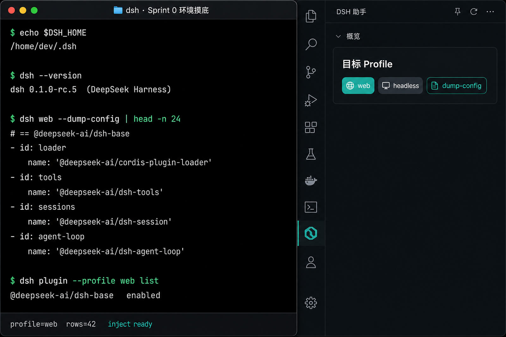
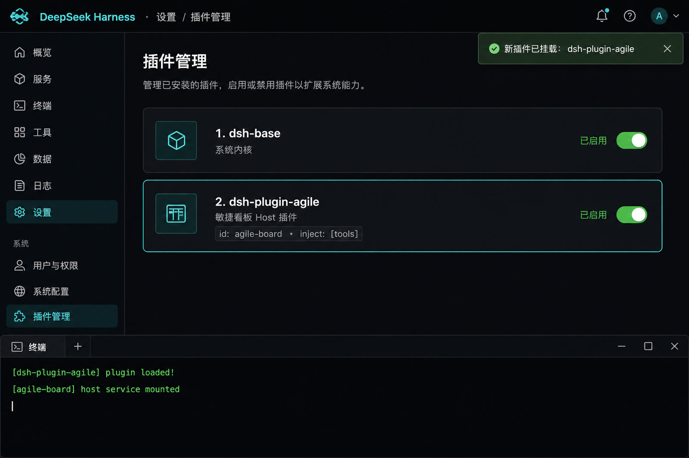
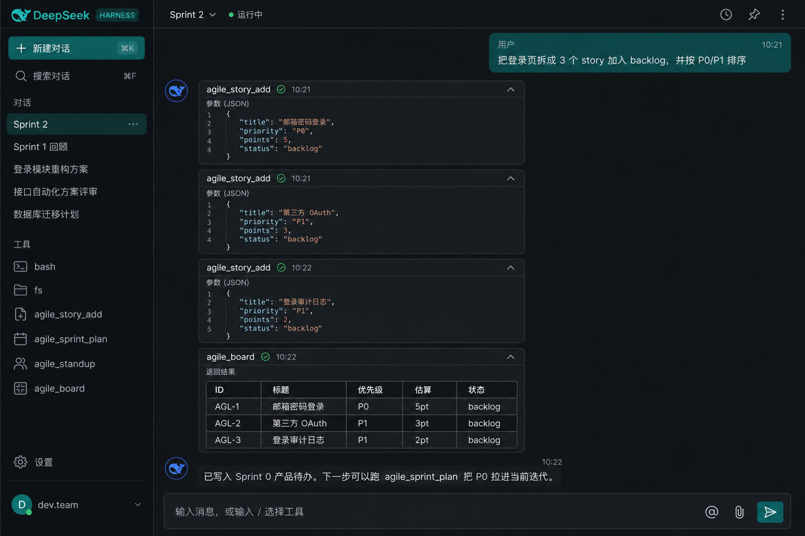
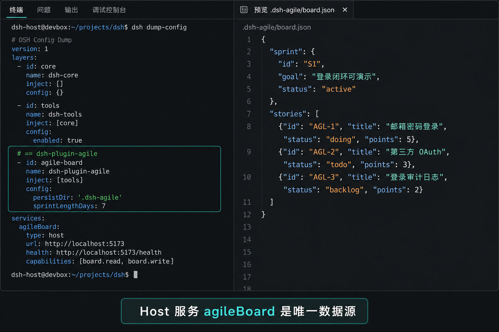
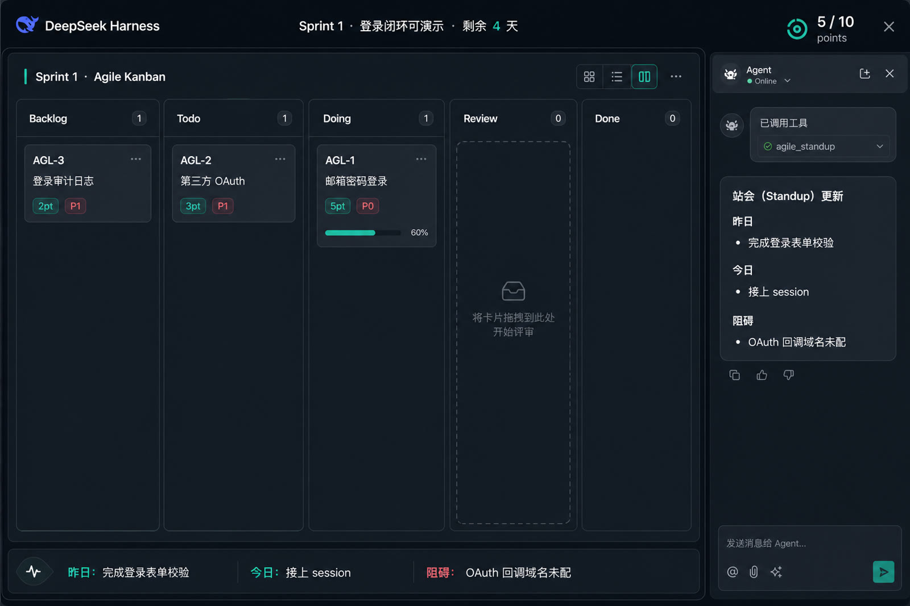
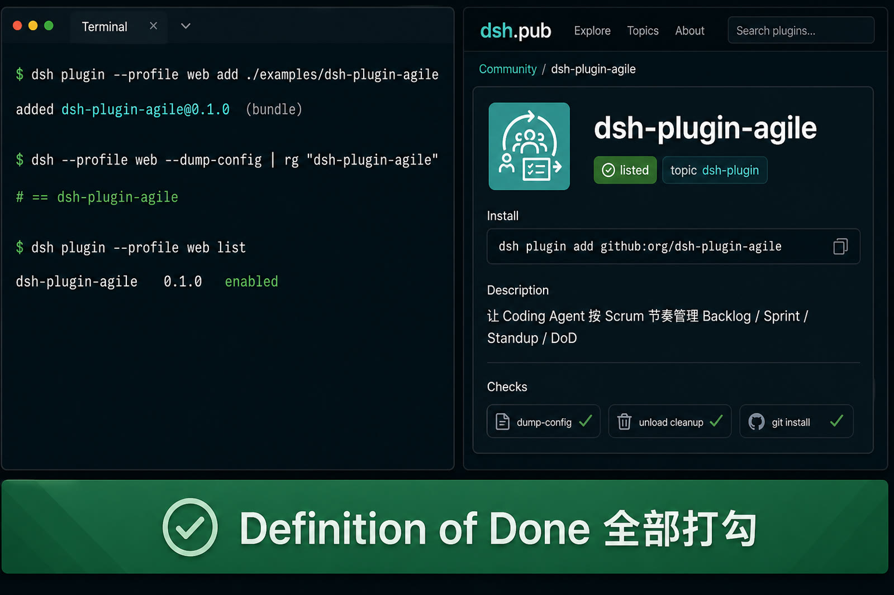

# DSH 插件敏捷开发实战：六步做出可安装的 Scrum 看板

DeepSeek Harness（DSH）把运行时拆成可卸载的 Cordis 插件：工具、会话、Agent Loop、Web UI 都是同一套生命周期。本文用 **Scrum 的短迭代** 开发一个真实插件 [`dsh-plugin-agile`](./examples/dsh-plugin-agile/)，让 Coding Agent 能管理 Backlog、Sprint、Standup 与 Definition of Done。每一步都给出可演示增量，并配效果图。

> 契约以官方文档为准：[第一个插件](https://deepseek-harness.github.io/deepseek-harness/en/develop/basic/)、[打包安装](https://deepseek-harness.github.io/deepseek-harness/en/develop/basic/publish)、[编写工具](https://deepseek-harness.github.io/deepseek-harness/en/develop/basic/tool)、[独立仓库指南](https://dsh.pub/develop-plugin.md)。服务名、slot 名必须以本机已安装版本的 `.d.ts` 与 `dsh --dump-config` 为准，禁止臆造。


## 1. 为什么用敏捷做 DSH 插件

一次写完 Host 服务、工具、Web 看板、Bundle 清单，最常见的失败不是代码编译不过，而是：

- 插件路径写成相对路径，Loader 从 **Profile 目录**解析，模块根本没挂上；
- 没声明 `inject: ['tools']`，`apply` 跑在工具注册表就绪之前；
- 包里没有 `dsh.bundle.patch`，`dsh plugin add` 只装成普通依赖，组合树里看不到新层；
- 浏览器侧猜了一个 slot 名字，UI 静默不出现。

敏捷把这些风险切成 **每次都能验收的增量**：先证明插件能挂上，再证明 Agent 能调工具，再证明数据有唯一所有者，最后才谈看板与发布。

| 对象 | 职责 | 能否被 `dsh plugin add` 单独激活 |
| --- | --- | --- |
| Host 模块 | `apply(ctx)` 注册工具 / 服务 / 副作用 | 否 |
| Web Client 模块 | 浏览器 slot / 主题 | 否 |
| Bundle | `cordis.patch.yml` 插入或覆盖组合树行 | 是 |
| Profile | 用户侧的 bundles 顺序与本地补丁 | 作者不分发 |


本教程的产品 Backlog 只有一张史诗：**让 Agent 按 Scrum 节奏改代码**。配套实现在 `examples/dsh-plugin-agile/`，领域模型不依赖 Harness，可先跑 `npm test`。

## 2. Sprint 0：环境与契约摸底

**Sprint Goal**：锁定目标 Harness 版本、目标 Profile，以及要插入的组合树位置。没有这一步，后面所有“看起来能跑”都不可复现。

### 2.1 做什么

```bash
echo "$DSH_HOME"
dsh --version
dsh plugin --profile web list
dsh web --dump-config | head
```

从源码树启动时，把 `dsh` 换成 `pnpm dsh`。记下：

1. Profile 名称（教学默认 `web`；无 UI 验证用 `headless`）；
2. 组合树里是否已有 `tools`、`sessions`、`agent-loop`；
3. 准备插入的 **稳定 row id**（本文用 `agile-board`）。

### 2.2 验收标准

- 能打印出版本与 `$DSH_HOME`；
- `--dump-config` 出现 `# == @deepseek-ai/dsh-base` 这一层；
- 决定本插件走 **Host-first**（工具 + 持久化），Web 看板作为后续增量。

### 2.3 效果图



## 3. Sprint 1：Hello 挂载——最小可运行增量

**Sprint Goal**：组合树出现新行，进程启动时打印加载日志。还不注册工具。

### 3.1 用户故事

> 作为插件作者，我希望用绝对路径把一个 `apply(ctx)` 模块补丁进 web profile，以便确认 Loader 真的调用了我的代码。

### 3.2 最小 Host 模块

```js
export const name = 'dsh-plugin-agile'

export function apply(ctx) {
  ctx.effect(() => {
    console.log('[dsh-plugin-agile] plugin loaded')
    return () => console.log('[dsh-plugin-agile] plugin unloaded')
  })
}
```

本地试跑用 `--patch` 覆盖层，**插件 `name` 必须是绝对路径**。补丁文件只贡献配置，不会把解析根改成补丁文件所在目录：

```yaml
- insert:
    - id: agile-board
      name: '/absolute/path/to/dsh-plugin-agile/src/index.js'
```

```bash
dsh web --patch ./cordis.patch.yml
```

打包后的 Bundle 则改成包名 `dsh-plugin-agile`，由 Node 解析已安装代码，见 Sprint 5。

### 3.3 验收标准

- 终端出现 `[dsh-plugin-agile] plugin loaded`；
- 停进程或热替换后出现 `plugin unloaded`（时间可组合性：卸载必须能回滚）；
- 设置 → 插件管理能看到对应行（Web profile）。

### 3.4 效果图



## 4. Sprint 2：注册敏捷工具——Agent 可调用

**Sprint Goal**：模型能把一句话需求拆成 Backlog 故事。这是第一个业务增量。

### 4.1 用户故事

> 作为使用者，我希望对 Agent 说“把登录页拆成 3 个 story”，它调用 `agile_story_add` 而不是只在聊天里列清单。

### 4.2 关键实现

声明依赖，让 Cordis 等到 `tools` 服务就绪再进入 `ACTIVE`：

```js
import { defineTool } from '@deepseek-ai/dsh-tools'

export const name = 'dsh-plugin-agile'
export const inject = ['tools']

export function apply(ctx) {
  ctx.tools.register(defineTool({
    name: 'agile_story_add',
    description: 'Add a user story to the Scrum backlog.',
    parameters: {
      title: { type: 'string', required: true, description: 'Story title' },
      priority: { type: 'string', description: 'P0, P1, or P2' },
      points: { type: 'number', description: 'Story points' },
    },
    output: {
      schema: { type: 'object' },
      render: (_args, value) => [{ type: 'text', text: JSON.stringify(value, null, 2) }],
    },
    async execute(args) {
      return addStory(board, args)
    },
  }))
}
```

`defineTool` 会在 `execute` 前校验参数，并把 schema 送进 system prompt。完整工具清单在 [`src/catalog.js`](./examples/dsh-plugin-agile/src/catalog.js)：

| 工具 | 增量能力 |
| --- | --- |
| `agile_story_add` | 写入用户故事 |
| `agile_sprint_plan` | 激活迭代，默认拉取全部 P0 |
| `agile_status` | 在 backlog / todo / doing / review / done 间移动 |
| `agile_blocker` | 登记阻碍 |
| `agile_standup` | 生成昨日 / 今日 / 阻碍 |
| `agile_board` | 导出看板快照 |
| `agile_dod_check` | 检查本迭代是否满足 DoD |

无 API Key 时，可用官方教程同款的 `ctx.tools.execute(...)` 走一遍执行管道，确认工具回复而不是先叫模型。

### 4.3 验收标准

- `--dump-config` 中 `agile-board` 行仍在，且 Host 模块 `inject` 含 `tools`；
- 对话里出现工具卡片，返回 `AGL-1` 这种稳定 id；
- 卸载插件后，模型不再看到这组工具。

### 4.4 效果图



## 5. Sprint 3：Host 服务成为唯一数据源

**Sprint Goal**：看板状态活过一次重启。浏览器和模型都只是这个数据源的投影。

### 5.1 用户故事

> 作为团队，我希望 Sprint 看板写在工作区 `.dsh-agile/board.json`，以便 Git 可审、Agent 可读、卸载插件也不会把故事只留在某次聊天里。

### 5.2 关键实现

领域模型与 Harness 解耦，见 [`src/board.js`](./examples/dsh-plugin-agile/src/board.js) 与 [`src/store.js`](./examples/dsh-plugin-agile/src/store.js)。Bundle 补丁把可覆盖配置放在 row 上：

```yaml
- insert:
    - id: agile-board
      name: dsh-plugin-agile
      config:
        persistDir: '.dsh-agile'
        sprintLengthDays: 7
```

后续层若覆盖同一 `id`，会 **整份替换** `config`，而不是深合并；用户要改持久化目录时必须把需要的键一并写出。

持久化示例：

```json
{
  "sprint": {
    "id": "S1",
    "goal": "登录闭环可演示",
    "status": "active",
    "lengthDays": 7
  },
  "stories": [
    { "id": "AGL-1", "title": "邮箱密码登录", "priority": "P0", "points": 5, "status": "doing" }
  ]
}
```

不在 `apply` 的模块顶层创建定时器或文件句柄；外部资源一律进 `ctx.effect()`，保证 DISPOSED 时能清掉。

### 5.3 验收标准

- 重启 `dsh web` 后 `agile_board` 仍能读到同一批 id；
- 工作区出现 `.dsh-agile/board.json`；
- `npm test` 覆盖加故事、拉 Sprint、Standup、DoD、hydrate 续号（不需要安装 DSH）。

### 5.4 效果图



## 6. Sprint 4：看板演示——UI 只读 Host 快照

**Sprint Goal**：人能看见列；Agent 仍然只通过工具改状态。

### 6.1 用户故事

> 作为开发者，我希望在 Web UI 里看到 Backlog / Todo / Doing / Review / Done，并且 Standup 文案与 `agile_standup` 一致。

### 6.2 做法与边界

独立仓库若要做双面插件，需要同时满足：

1. Host 继续拥有 `board.json`；
2. `package.json` 声明 `exports["./client"]` 与 `dsh.client`；
3. **先在本机 Harness 源码里核实 slot 名、props、基数**，再 `ctx.slots.register`；
4. 客户端产物必须是 Harness 兼容的 `window.__ModuleLoader__.load({ id, factory })` 工厂包，不能把 ESM 源文件直接拷到 `lib/client.js`。

slot 是类型化运行时契约，不是 DOM 选择器。本教学插件因此保持 **Host-first**：Agent 用工具改板，人用静态预览看目标界面。把下面这个文件用浏览器打开，即是本迭代的演示增量：

- [Kanban 效果预览 `assets/demo-kanban.html`](./assets/demo-kanban.html)
- 客户端模板：[`src/client.js`](./examples/dsh-plugin-agile/src/client.js)

接到真实 DSH 版本后，再把核实过的 slot 填进模板，而不是把示例 id 抄进生产包。

### 6.3 验收标准

- 预览页五列与工具状态机一致；
- Standup 文案能从 `agile_standup` 的 JSON 直接渲染；
- 不把乐观更新当成已经写入 Host。

### 6.4 效果图



## 7. Sprint 5：Bundle 安装、验收与发布

**Sprint Goal**：别人只用一行 `dsh plugin add` 就能得到与你本机相同的组合树层。

### 7.1 用户故事

> 作为使用者，我希望把插件装进自己的 web profile，用 `--dump-config` 看到 `# == dsh-plugin-agile`，并且能卸载干净。

### 7.2 打包要点

`package.json` 必须声明 Bundle，否则 CLI 会警告并只当普通依赖：

```json
{
  "name": "dsh-plugin-agile",
  "type": "module",
  "main": "./src/index.js",
  "dsh": {
    "bundle": { "patch": "./cordis.patch.yml" }
  }
}
```

`cordis.patch.yml` 里的 `name` 必须与安装后的包名一致（此处为 `dsh-plugin-agile`），不要再写开发机绝对路径。

```bash
# 在插件目录构建并链到 web profile
npm run build
dsh plugin --profile web add ./examples/dsh-plugin-agile
dsh --profile web --dump-config
dsh web --profile web
```

本仓库根 `.gitignore` 忽略 `lib/`，因此教学示例以 `src/` 为运行时入口。独立插件仓库仍应提交可直接加载的构建产物。从 Git 安装时，pnpm 10+ 默认不跑依赖的 `prepare`；若必须远程构建，需在 profile 的 `pnpm-workspace.yaml` 里显式 `allowBuilds`，并 **钉死 commit**。

社区发现可加 GitHub topic [`dsh-plugin`](https://github.com/topics/dsh-plugin)；要进 [dsh.pub](https://dsh.pub/en/plugins/) 目录则走其提交页，目录收录不是安全审计。

### 7.3 Definition of Done

- [ ] 目标 DSH 版本与 profile 已记录（Sprint 0）
- [ ] Host / Web / 双面 的所有权写清楚；本包是 Host-first
- [ ] `dsh.bundle.patch` 存在且为包内普通文件
- [ ] patch 使用稳定 id `agile-board`，`name` 为已安装包名
- [ ] 包入口可直接加载（本示例为 `src/index.js`），外部依赖无 `workspace:`
- [ ] 持久化路径、卸载清理、失败态有文档
- [ ] `npm test` 与 `npm run check` 通过
- [ ] `--dump-config` 出现 `# == dsh-plugin-agile`
- [ ] `dsh plugin --profile web remove dsh-plugin-agile` 后工具消失

### 7.4 效果图



## 8. 一步一览

| 步骤 | 交付物 | 你应当看见 |
| --- | --- | --- |
| Sprint 0 | 版本 + 组合树 | `dsh --version`、`# == @deepseek-ai/dsh-base` |
| Sprint 1 | Hello `apply` | `[dsh-plugin-agile] plugin loaded` |
| Sprint 2 | 7 个 agile_* 工具 | 对话里的工具卡片与 `AGL-1` |
| Sprint 3 | `.dsh-agile/board.json` | 重启后故事还在 |
| Sprint 4 | 五列看板预览 | [demo-kanban.html](./assets/demo-kanban.html) |
| Sprint 5 | 可安装 Bundle | `# == dsh-plugin-agile` |

日常开发循环（官方与社区 Skill 已验证）：

```text
改需求 → 改 Host 模块 / 测试 → dsh plugin add → dump-config →
重启 dsh web → 对话或 headless 调工具 → 卸载确认回滚
```

## 9. 踩坑速查

| 现象 | 根因 | 修法 |
| --- | --- | --- |
| 补丁写了但进程毫无反应 | 相对路径；Loader 从 Profile 目录解析 | patch 开发期用绝对路径，Bundle 用包名 |
| `apply` 里 `ctx.tools` 为空 | 未导出 `inject = ['tools']` | 按服务依赖等待，不要靠文件顺序 |
| `plugin add` 成功但 dump-config 无新层 | 缺少 `dsh.bundle.patch` | 按 Sprint 5 补清单 |
| Git 安装没有 `lib/` | 只发了源码且 `prepare` 被 pnpm 拦住 | 提交构建产物，或 allowBuilds + 钉 commit |
| Web 插件装上但页面空白 | slot 名猜错，或 client 不是工厂包 | 对已安装版本核契约；headless 成功 ≠ UI 已加载 |
| 卸载后定时器还在跑 | 副作用没进 `ctx.effect()` | 所有外部资源返回 disposer |

## 10. 本地验证（本仓库）

领域模型不需要 DSH 安装：

```bash
cd 08_agentic_system/dsh_plugin/examples/dsh-plugin-agile
npm test
npm run check
npm run build
```

已安装 `dsh` 时，用一次性 profile 验收 Bundle，不要直接改全局 `$DSH_HOME`。

## 11. 参考

- [Your first plugin](https://deepseek-harness.github.io/deepseek-harness/en/develop/basic/)
- [Package and install a plugin](https://deepseek-harness.github.io/deepseek-harness/en/develop/basic/publish)
- [Build a tool](https://deepseek-harness.github.io/deepseek-harness/en/develop/basic/tool)
- [Plugins and lifecycle](https://deepseek-harness.github.io/deepseek-harness/en/develop/framework/)
- [dsh.pub develop-plugin.md](https://dsh.pub/develop-plugin.md)
- 本仓库：[驾驭工程](../../98_llm_programming/Harness_Engineering.md)、[OpenHarness 深入浅出](../agent_infra/docs/openharness-deep-dive.md)
